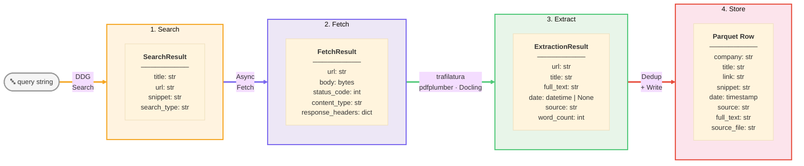
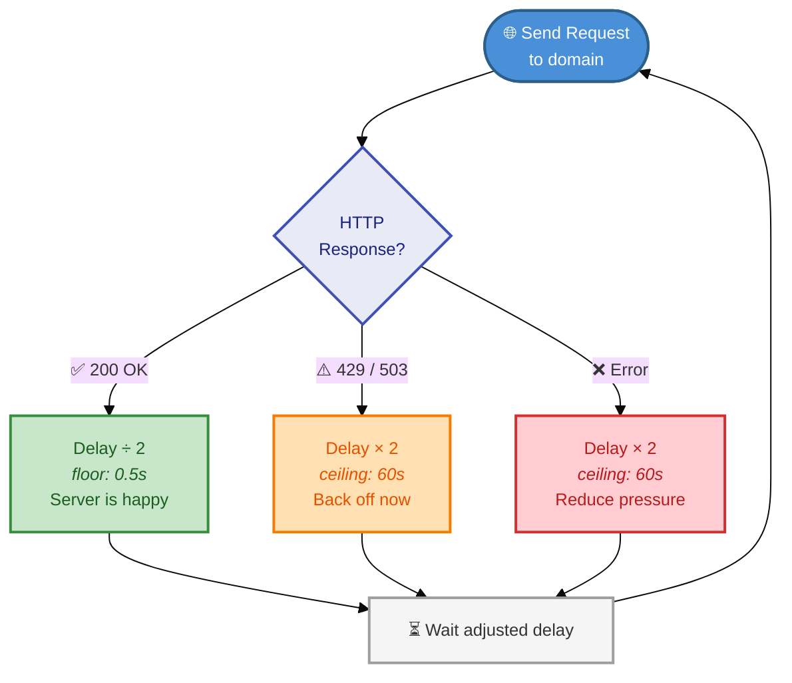
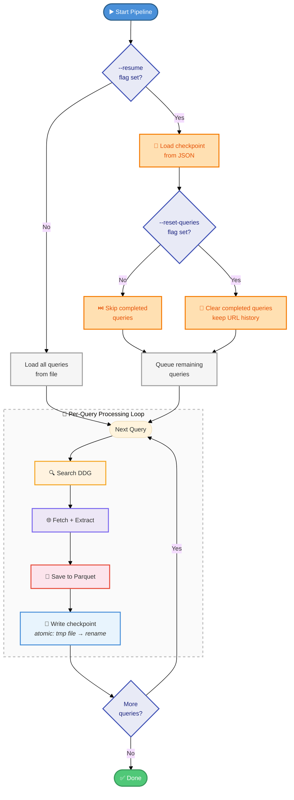
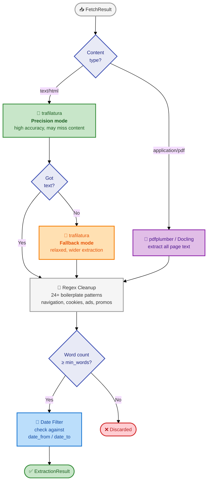

# Architecture

## Pipeline Flow

```mermaid
%%{init: {'theme': 'base', 'themeVariables': {'primaryColor': '#4a90d9', 'lineColor': '#5c6bc0', 'fontSize': '14px'}}}%%
flowchart LR
    A([" 📄 Query File\n<i>one per line</i> "]):::blue
    B([" 🔍 DDG Search\n<i>text / news · retry</i> "]):::orange
    C([" 🌐 Async Fetch\n<i>aiohttp · throttle · Tor</i> "]):::purple
    D([" 📝 Extract\n<i>trafilatura · pdfplumber · Docling</i> "]):::green
    E([" 💾 Dedup + Store\n<i>Parquet · JSONL · checkpoint</i> "]):::red

    A --> B --> C --> D --> E

    classDef blue fill:#4a90d9,stroke:#2c5f8a,color:#fff,stroke-width:2px
    classDef orange fill:#f5a623,stroke:#c47d0e,color:#fff,stroke-width:2px
    classDef purple fill:#7b68ee,stroke:#5a4bc7,color:#fff,stroke-width:2px
    classDef green fill:#50c878,stroke:#3a9a5c,color:#fff,stroke-width:2px
    classDef red fill:#e74c3c,stroke:#c0392b,color:#fff,stroke-width:2px

    linkStyle 0 stroke:#5c6bc0,stroke-width:3px
    linkStyle 1 stroke:#5c6bc0,stroke-width:3px
    linkStyle 2 stroke:#5c6bc0,stroke-width:3px
    linkStyle 3 stroke:#5c6bc0,stroke-width:3px
```

## Module Map

```mermaid
%%{init: {'theme': 'base', 'themeVariables': {'fontSize': '13px'}}}%%
graph TB
    subgraph CLI["&nbsp; 🖥️ CLI Layer &nbsp;"]
        direction LR
        main["<b>main.py</b>\nargparse subcommands\nsearch · crawl · transcripts"]
        dunder_main["<b>__main__.py</b>\npython -m entry point"]
    end

    subgraph Core["&nbsp; ⚙️ Core &nbsp;"]
        direction LR
        config["<b>config.py</b>\nScraperConfig\nfrozen dataclass\n30+ fields"]
        pipeline["<b>pipeline.py</b>\nSearch orchestrator\nwires all stages"]
        checkpoint["<b>checkpoint.py</b>\nAtomic JSON saves\ncrash recovery"]
    end

    subgraph Crawl_mod["&nbsp; 🕷️ crawl/ &nbsp;"]
        crawl_config["<b>config.py</b>\nCrawlConfig\nfrozen dataclass"]
        crawl_pipeline["<b>pipeline.py</b>\nCrawlPipeline\ncrawl4ai → extract → store"]
        crawl_strategy["<b>strategy.py</b>\nBFS strategy builder\nscoring + filters"]
    end

    subgraph Search_mod["&nbsp; 🔍 search/ &nbsp;"]
        ddg["<b>duckduckgo.py</b>\nDDG text + news\ntenacity retry\nTor circuit renewal"]
    end

    subgraph Fetch_mod["&nbsp; 🌐 fetch/ &nbsp;"]
        client["<b>client.py</b>\nAsync HTTP client\nsession management"]
        fingerprints["<b>fingerprints.py</b>\n5 browser profiles\nUA + headers + TLS"]
        throttle["<b>throttle.py</b>\nPer-domain adaptive\nrate limiter"]
        robots["<b>robots.py</b>\nrobots.txt fetch\ncompliance check"]
        tor["<b>tor.py</b>\nSOCKS5 proxy\nstem circuit renewal"]
    end

    subgraph Extract_mod["&nbsp; 📝 extract/ &nbsp;"]
        html["<b>html.py</b>\ntrafilatura 2-pass\nprecision → fallback"]
        pdf["<b>pdf.py</b>\npdfplumber · Docling\nPDF text extraction"]
        clean["<b>clean.py</b>\n24+ regex patterns\nboilerplate + content-type filter"]
        date_filter["<b>date_filter.py</b>\nYYYY-MM-DD range\npost-extraction filter"]
        links["<b>links.py</b>\nBFS link extraction\nsame-domain filter"]
    end

    subgraph Store_mod["&nbsp; 💾 store/ &nbsp;"]
        dedup["<b>dedup.py</b>\nURL normalization\nSHA256 + MinHash LSH"]
        output["<b>output.py</b>\nParquet snappy append\nJSONL writer"]
    end

    dunder_main ==> main
    main ==> config
    main ==> pipeline
    main ==> crawl_pipeline
    pipeline --> ddg
    pipeline --> client
    pipeline --> html
    pipeline --> pdf
    pipeline --> clean
    pipeline --> date_filter
    pipeline --> links
    pipeline --> dedup
    pipeline --> output
    pipeline --> checkpoint
    client -.-> fingerprints
    client -.-> throttle
    client -.-> robots
    client -.-> tor
    crawl_pipeline --> crawl_config
    crawl_pipeline --> crawl_strategy
    crawl_pipeline --> html
    crawl_pipeline --> pdf
    crawl_pipeline --> clean
    crawl_pipeline --> date_filter
    crawl_pipeline --> dedup
    crawl_pipeline --> output
    crawl_pipeline --> checkpoint

    subgraph Transcript_mod["&nbsp; 📞 transcripts/ &nbsp;"]
        transcript_config["<b>config.py</b>\nTranscriptConfig\nfrozen dataclass"]
        transcript_pipeline["<b>pipeline.py</b>\nTranscriptPipeline\ndiscover → fetch → extract → store"]
        transcript_discovery["<b>discovery.py</b>\nSitemap-based\nURL discovery"]
        transcript_extract["<b>extract.py</b>\nHTML transcript\nextraction"]
    end

    subgraph Backfill_mod["&nbsp; 🔄 Standalone Backfill &nbsp;"]
        direction LR
        alphastreet["<b>AlphaStreet</b>\nsitemap discovery\n2019-2026"]
        wayback["<b>Wayback+SA</b>\nCDX API discovery\n2007-2020"]
        merge["<b>Merge</b>\ndedup by ticker\nyear, quarter"]
    end

    main ==> transcript_pipeline
    transcript_pipeline --> transcript_config
    transcript_pipeline --> transcript_discovery
    transcript_pipeline --> transcript_extract
    transcript_pipeline --> dedup
    transcript_pipeline --> output
    transcript_pipeline --> checkpoint

    classDef cliStyle fill:#f8f9fa,stroke:#6c757d,stroke-width:2px
    classDef coreStyle fill:#e8f4fd,stroke:#4a90d9,stroke-width:2px
    classDef searchStyle fill:#fff3e0,stroke:#f5a623,stroke-width:2px
    classDef fetchStyle fill:#ede7f6,stroke:#7b68ee,stroke-width:2px
    classDef extractStyle fill:#e8f5e9,stroke:#50c878,stroke-width:2px
    classDef storeStyle fill:#fce4ec,stroke:#e74c3c,stroke-width:2px
    classDef crawlStyle fill:#e0f7fa,stroke:#00838f,stroke-width:2px

    class main,dunder_main cliStyle
    class config,pipeline,checkpoint coreStyle
    class ddg searchStyle
    class client,fingerprints,throttle,robots,tor fetchStyle
    class html,pdf,clean,date_filter,links extractStyle
    class dedup,output storeStyle
    class crawl_config,crawl_pipeline,crawl_strategy crawlStyle
    classDef transcriptStyle fill:#fff9c4,stroke:#f9a825,stroke-width:2px
    class transcript_config,transcript_pipeline,transcript_discovery,transcript_extract transcriptStyle

    style CLI fill:#f8f9fa,stroke:#6c757d,stroke-width:2px,stroke-dasharray: 0
    style Core fill:#e8f4fd,stroke:#4a90d9,stroke-width:2px,stroke-dasharray: 0
    style Search_mod fill:#fff3e0,stroke:#f5a623,stroke-width:2px,stroke-dasharray: 0
    style Fetch_mod fill:#ede7f6,stroke:#7b68ee,stroke-width:2px,stroke-dasharray: 0
    style Extract_mod fill:#e8f5e9,stroke:#50c878,stroke-width:2px,stroke-dasharray: 0
    style Store_mod fill:#fce4ec,stroke:#e74c3c,stroke-width:2px,stroke-dasharray: 0
    style Crawl_mod fill:#e0f7fa,stroke:#00838f,stroke-width:2px,stroke-dasharray: 0
    style Transcript_mod fill:#fff9c4,stroke:#f9a825,stroke-width:2px,stroke-dasharray: 0
```

## Data Flow

Each query passes through four typed result stages:

```mermaid
%%{init: {'theme': 'base', 'themeVariables': {'fontSize': '13px'}}}%%
flowchart LR
    Q(["🔤 query string"]):::grey

    subgraph S1["&nbsp; 1. Search &nbsp;"]
        SR["<b>SearchResult</b>\n──────────\ntitle: str\nurl: str\nsnippet: str\nsearch_type: str"]
    end

    subgraph S2["&nbsp; 2. Fetch &nbsp;"]
        FR["<b>FetchResult</b>\n──────────\nurl: str\nbody: bytes\nstatus_code: int\ncontent_type: str\nresponse_headers: dict"]
    end

    subgraph S3["&nbsp; 3. Extract &nbsp;"]
        ER["<b>ExtractionResult</b>\n──────────\nurl: str\ntitle: str\nfull_text: str\ndate: datetime | None\nsource: str\nword_count: int"]
    end

    subgraph S4["&nbsp; 4. Store &nbsp;"]
        PR["<b>Parquet Row</b>\n──────────\ncompany: str\ntitle: str\nlink: str\nsnippet: str\ndate: timestamp\nsource: str\nfull_text: str\nsource_file: str"]
    end

    Q ==>|"DDG\nSearch"| S1
    S1 ==>|"Async\nFetch"| S2
    S2 ==>|"trafilatura\npdfplumber · Docling"| S3
    S3 ==>|"Dedup\n+ Write"| S4

    classDef grey fill:#f5f5f5,stroke:#999,stroke-width:2px
    style S1 fill:#fff3e0,stroke:#f5a623,stroke-width:2px
    style S2 fill:#ede7f6,stroke:#7b68ee,stroke-width:2px
    style S3 fill:#e8f5e9,stroke:#50c878,stroke-width:2px
    style S4 fill:#fce4ec,stroke:#e74c3c,stroke-width:2px

    linkStyle 0 stroke:#f5a623,stroke-width:3px
    linkStyle 1 stroke:#7b68ee,stroke-width:3px
    linkStyle 2 stroke:#50c878,stroke-width:3px
    linkStyle 3 stroke:#e74c3c,stroke-width:3px
```

## Adaptive Throttle Strategy

Each domain maintains its own independent delay that adjusts based on server responses:

```mermaid
%%{init: {'theme': 'base', 'themeVariables': {'fontSize': '13px'}}}%%
flowchart TD
    REQ([" 🌐 Send Request\nto domain "]):::blue --> RESP{"HTTP\nResponse?"}:::decision

    RESP -->|"✅ 200 OK"| GOOD["Delay ÷ 2\n<i>floor: 0.5s</i>\nServer is happy"]:::green
    RESP -->|"⚠️ 429 / 503"| RATE["Delay × 2\n<i>ceiling: 60s</i>\nBack off now"]:::orange
    RESP -->|"❌ Error"| ERR["Delay × 2\n<i>ceiling: 60s</i>\nReduce pressure"]:::red

    GOOD --> WAIT["⏳ Wait adjusted delay"]:::grey
    RATE --> WAIT
    ERR --> WAIT
    WAIT --> REQ

    classDef blue fill:#4a90d9,stroke:#2c5f8a,color:#fff,stroke-width:2px
    classDef green fill:#c8e6c9,stroke:#388e3c,color:#1b5e20,stroke-width:2px
    classDef orange fill:#ffe0b2,stroke:#f57c00,color:#e65100,stroke-width:2px
    classDef red fill:#ffcdd2,stroke:#d32f2f,color:#b71c1c,stroke-width:2px
    classDef grey fill:#f5f5f5,stroke:#9e9e9e,stroke-width:2px
    classDef decision fill:#e8eaf6,stroke:#3f51b5,color:#1a237e,stroke-width:2px
```

**Convergence:** The halve-on-success / double-on-failure strategy means each domain converges to its maximum sustainable rate independently. A single slow or rate-limiting domain doesn't affect the others.

## Checkpoint & Resume Flow

```mermaid
%%{init: {'theme': 'base', 'themeVariables': {'fontSize': '13px'}}}%%
flowchart TD
    START([" ▶️ Start Pipeline "]):::blue --> CHECK{"--resume\nflag set?"}:::decision

    CHECK -->|"No"| FRESH["Load all queries\nfrom file"]:::grey
    CHECK -->|"Yes"| LOAD["📂 Load checkpoint\nfrom JSON"]:::orange
    LOAD --> RESET{"--reset-queries\nflag set?"}:::decision
    RESET -->|"No"| SKIP["⏭️ Skip completed\nqueries"]:::orange
    RESET -->|"Yes"| CLEAR["🔄 Clear completed queries\nkeep URL history"]:::orange
    SKIP --> PROC["Queue remaining\nqueries"]:::grey
    CLEAR --> PROC
    FRESH --> LOOP
    PROC --> LOOP

    subgraph loop_box["&nbsp; 🔄 Per-Query Processing Loop &nbsp;"]
        LOOP(["Next Query"]) --> SEARCH["🔍 Search DDG"]:::search
        SEARCH --> FETCH["🌐 Fetch + Extract"]:::fetch
        FETCH --> SAVE["💾 Save to Parquet"]:::store
        SAVE --> CP["📝 Write checkpoint\n<i>atomic: tmp file → rename</i>"]:::checkpoint
    end

    CP --> DONE{"More\nqueries?"}:::decision
    DONE -->|"Yes"| LOOP
    DONE -->|"No"| FIN([" ✅ Done "]):::green

    classDef blue fill:#4a90d9,stroke:#2c5f8a,color:#fff,stroke-width:2px
    classDef green fill:#50c878,stroke:#3a9a5c,color:#fff,stroke-width:2px
    classDef orange fill:#ffe0b2,stroke:#f57c00,color:#e65100,stroke-width:2px
    classDef grey fill:#f5f5f5,stroke:#9e9e9e,stroke-width:2px
    classDef decision fill:#e8eaf6,stroke:#3f51b5,color:#1a237e,stroke-width:2px
    classDef search fill:#fff3e0,stroke:#f5a623,stroke-width:2px
    classDef fetch fill:#ede7f6,stroke:#7b68ee,stroke-width:2px
    classDef store fill:#fce4ec,stroke:#e74c3c,stroke-width:2px
    classDef checkpoint fill:#e8f4fd,stroke:#4a90d9,stroke-width:2px

    style loop_box fill:#fafafa,stroke:#bdbdbd,stroke-width:2px,stroke-dasharray: 5 5
```

## Extraction Detail

The extraction stage handles both HTML and PDF content with a multi-step process:

```mermaid
%%{init: {'theme': 'base', 'themeVariables': {'fontSize': '13px'}}}%%
flowchart TD
    INPUT(["📥 FetchResult"]):::grey --> TYPE{"Content\ntype?"}:::decision

    TYPE -->|"text/html"| PASS1["🎯 trafilatura\n<b>Precision mode</b>\nhigh accuracy, may miss content"]:::green
    TYPE -->|"application/pdf"| PDF["📄 pdfplumber / Docling\nextract all page text"]:::purple

    PASS1 --> CHECK1{"Got\ntext?"}:::decision
    CHECK1 -->|"Yes"| CLEAN
    CHECK1 -->|"No"| PASS2["🔄 trafilatura\n<b>Fallback mode</b>\nrelaxed, wider extraction"]:::orange
    PASS2 --> CLEAN

    PDF --> CLEAN

    CLEAN["🧹 Regex Cleanup\n24+ boilerplate patterns\nnavigation, cookies, ads, promos"]:::grey --> WORDS{"Word count\n≥ min_words?"}:::decision
    WORDS -->|"Yes"| DATE["📅 Date Filter\ncheck against\ndate_from / date_to"]:::blue
    WORDS -->|"No"| DISCARD(["❌ Discarded"]):::red

    DATE --> KEEP(["✅ ExtractionResult"]):::green

    classDef grey fill:#f5f5f5,stroke:#9e9e9e,stroke-width:2px
    classDef green fill:#c8e6c9,stroke:#388e3c,color:#1b5e20,stroke-width:2px
    classDef orange fill:#ffe0b2,stroke:#f57c00,color:#e65100,stroke-width:2px
    classDef purple fill:#e1bee7,stroke:#8e24aa,color:#4a148c,stroke-width:2px
    classDef blue fill:#bbdefb,stroke:#1976d2,color:#0d47a1,stroke-width:2px
    classDef red fill:#ffcdd2,stroke:#d32f2f,color:#b71c1c,stroke-width:2px
    classDef decision fill:#e8eaf6,stroke:#3f51b5,color:#1a237e,stroke-width:2px
```

## Design Rationale

**DuckDuckGo only**,No API keys, no billing, works through Tor. News mode produces strong results for financial content without rate-limit pressure.

**trafilatura over BeautifulSoup**,Purpose-built for main content extraction with metadata (title, date, author). The 2-pass strategy (precision mode first, then relaxed fallback) maximizes recall without sacrificing quality.

**Adaptive per-domain throttling**,Each domain gets its own delay that adjusts dynamically: successful fetches halve the delay (floor 0.5s), 429/503 responses double it (ceiling 60s). This converges to the optimal rate per site without a single slow domain blocking the whole pipeline.

**Frozen dataclass config**,`ScraperConfig` is immutable after creation. Stealth mode creates a new instance with overrides rather than mutating state during async execution.

**Checkpoint per query**,Queries are the natural unit of work (5-20 pages each). Atomic JSON writes (write to temp file, then rename) prevent corruption on crash.

**Parquet output**,Columnar format with snappy compression. Schema matches the downstream `merged_by_year` pipeline for compatibility. Append mode allows incremental writes.

**Crawl subcommand (crawl4ai)**,The `crawl` subcommand uses crawl4ai's `AsyncWebCrawler` with `BestFirstCrawlingStrategy` for headless browser crawling. This handles JS-rendered pages, link discovery, BFS scheduling, and anti-detection internally. The crawl pipeline reuses the same extract/store layers (HTMLExtractor, TextCleaner, Deduplicator, ParquetWriter) as the search pipeline, keeping the architecture DRY. URL scoring prioritises financial content keywords and penalises deep or stale paths. PDF URLs encountered during crawling are detected (by URL extension or content-type header), downloaded directly, and extracted using the configured PDF backend (`--pdf-extractor`).

**PDF extraction**,Two backends are available: **pdfplumber** (lightweight, always installed) and **Docling** (layout-aware with table detection and hierarchical structure, optional via `pip install financial-scraper[docling]`). The `--pdf-extractor auto` default uses Docling when available, falling back to pdfplumber. Both backends produce the same `ExtractionResult` interface, so downstream dedup, filtering, and storage are unaffected by the choice.

**Multi-source transcript strategy**: No single source covers all tickers and years. The built-in pipeline handles Motley Fool (best for 2019+). Standalone backfill scripts target 4 additional sources: AlphaStreet (high hit rate for 2019-2026), Seeking Alpha via Wayback Machine CDX API (best for pre-2019 historical data), archived Motley Fool pages via Wayback Machine (2017-2020), and Research4 text files (S&P 500, 2015-2020). All sources share the same Parquet schema and deduplicate by `(company, year, quarter)`, keeping the longest transcript. A two-round quality fix pipeline (`_fix_parquet_issues.py`, `_fix_deep_issues.py`) cleans dates, removes paywall stubs, fixes encoding/HTML artifacts, and corrects misassigned tickers. Combined output: 27,800+ transcripts across 1,425 tickers (94.3% of US10002).
