# Architecture

## Pipeline Flow

```mermaid
%%{init: {'theme': 'base', 'themeVariables': {'primaryColor': '#4a90d9', 'lineColor': '#5c6bc0', 'fontSize': '14px'}}}%%
flowchart LR
    A([" 📄 Query File\n<i>one per line</i> "]):::blue
    B([" 🔍 DDG Search\n<i>text / news · retry</i> "]):::orange
    C([" 🌐 Async Fetch\n<i>aiohttp · throttle · Tor</i> "]):::purple
    D([" 📝 Extract\n<i>trafilatura · pdfplumber</i> "]):::green
    E([" 💾 Dedup + Store\n<i>Parquet · JSONL · checkpoint</i> "]):::red

    A --> B --> C --> D --> E

    classDef blue fill:#4a90d9,stroke:#2c5f8a,color:#fff,stroke-width:2px
    classDef orange fill:#f5a623,stroke:#c47d0e,color:#fff,stroke-width:2px
    classDef purple fill:#7b68ee,stroke:#5a4bc7,color:#fff,stroke-width:2px
    classDef green fill:#50c878,stroke:#3a9a5c,color:#fff,stroke-width:2px
    classDef red fill:#e74c3c,stroke:#c0392b,color:#fff,stroke-width:2px

    linkStyle 0 stroke:#5c6bc0,stroke-width:3px
    linkStyle 1 stroke:#5c6bc0,stroke-width:3px
    linkStyle 2 stroke:#5c6bc0,stroke-width:3px
    linkStyle 3 stroke:#5c6bc0,stroke-width:3px
```

## Module Map

```mermaid
%%{init: {'theme': 'base', 'themeVariables': {'fontSize': '13px'}}}%%
graph TB
    subgraph CLI["&nbsp; 🖥️ CLI Layer &nbsp;"]
        direction LR
        main["<b>main.py</b>\nargparse CLI\noutput path resolution"]
        dunder_main["<b>__main__.py</b>\npython -m entry point"]
    end

    subgraph Core["&nbsp; ⚙️ Core &nbsp;"]
        direction LR
        config["<b>config.py</b>\nScraperConfig\nfrozen dataclass\n30+ fields"]
        pipeline["<b>pipeline.py</b>\nOrchestrator\nwires all stages"]
        checkpoint["<b>checkpoint.py</b>\nAtomic JSON saves\ncrash recovery"]
    end

    subgraph Search_mod["&nbsp; 🔍 search/ &nbsp;"]
        ddg["<b>duckduckgo.py</b>\nDDG text + news\ntenacity retry\nTor circuit renewal"]
    end

    subgraph Fetch_mod["&nbsp; 🌐 fetch/ &nbsp;"]
        client["<b>client.py</b>\nAsync HTTP client\nsession management"]
        fingerprints["<b>fingerprints.py</b>\n5 browser profiles\nUA + headers + TLS"]
        throttle["<b>throttle.py</b>\nPer-domain adaptive\nrate limiter"]
        robots["<b>robots.py</b>\nrobots.txt fetch\ncompliance check"]
        tor["<b>tor.py</b>\nSOCKS5 proxy\nstem circuit renewal"]
    end

    subgraph Extract_mod["&nbsp; 📝 extract/ &nbsp;"]
        html["<b>html.py</b>\ntrafilatura 2-pass\nprecision → fallback"]
        pdf["<b>pdf.py</b>\npdfplumber\ntext extraction"]
        clean["<b>clean.py</b>\n10 regex patterns\nboilerplate removal"]
        date_filter["<b>date_filter.py</b>\nYYYY-MM-DD range\npost-extraction filter"]
    end

    subgraph Store_mod["&nbsp; 💾 store/ &nbsp;"]
        dedup["<b>dedup.py</b>\nURL normalization\nSHA256 content hash"]
        output["<b>output.py</b>\nParquet snappy append\nJSONL writer"]
    end

    dunder_main ==> main
    main ==> config
    main ==> pipeline
    pipeline --> ddg
    pipeline --> client
    pipeline --> html
    pipeline --> pdf
    pipeline --> clean
    pipeline --> date_filter
    pipeline --> dedup
    pipeline --> output
    pipeline --> checkpoint
    client -.-> fingerprints
    client -.-> throttle
    client -.-> robots
    client -.-> tor

    classDef cliStyle fill:#f8f9fa,stroke:#6c757d,stroke-width:2px
    classDef coreStyle fill:#e8f4fd,stroke:#4a90d9,stroke-width:2px
    classDef searchStyle fill:#fff3e0,stroke:#f5a623,stroke-width:2px
    classDef fetchStyle fill:#ede7f6,stroke:#7b68ee,stroke-width:2px
    classDef extractStyle fill:#e8f5e9,stroke:#50c878,stroke-width:2px
    classDef storeStyle fill:#fce4ec,stroke:#e74c3c,stroke-width:2px

    class main,dunder_main cliStyle
    class config,pipeline,checkpoint coreStyle
    class ddg searchStyle
    class client,fingerprints,throttle,robots,tor fetchStyle
    class html,pdf,clean,date_filter extractStyle
    class dedup,output storeStyle

    style CLI fill:#f8f9fa,stroke:#6c757d,stroke-width:2px,stroke-dasharray: 0
    style Core fill:#e8f4fd,stroke:#4a90d9,stroke-width:2px,stroke-dasharray: 0
    style Search_mod fill:#fff3e0,stroke:#f5a623,stroke-width:2px,stroke-dasharray: 0
    style Fetch_mod fill:#ede7f6,stroke:#7b68ee,stroke-width:2px,stroke-dasharray: 0
    style Extract_mod fill:#e8f5e9,stroke:#50c878,stroke-width:2px,stroke-dasharray: 0
    style Store_mod fill:#fce4ec,stroke:#e74c3c,stroke-width:2px,stroke-dasharray: 0
```

## Data Flow

Each query passes through four typed result stages:

```mermaid
%%{init: {'theme': 'base', 'themeVariables': {'fontSize': '13px'}}}%%
flowchart LR
    Q(["🔤 query string"]):::grey

    subgraph S1["&nbsp; 1. Search &nbsp;"]
        SR["<b>SearchResult</b>\n──────────\ntitle: str\nurl: str\nsnippet: str\nsearch_type: str"]
    end

    subgraph S2["&nbsp; 2. Fetch &nbsp;"]
        FR["<b>FetchResult</b>\n──────────\nurl: str\nbody: bytes\nstatus_code: int\ncontent_type: str\nresponse_headers: dict"]
    end

    subgraph S3["&nbsp; 3. Extract &nbsp;"]
        ER["<b>ExtractionResult</b>\n──────────\nurl: str\ntitle: str\nfull_text: str\ndate: datetime | None\nsource: str\nword_count: int"]
    end

    subgraph S4["&nbsp; 4. Store &nbsp;"]
        PR["<b>Parquet Row</b>\n──────────\ncompany: str\ntitle: str\nlink: str\nsnippet: str\ndate: timestamp\nsource: str\nfull_text: str\nsource_file: str"]
    end

    Q ==>|"DDG\nSearch"| S1
    S1 ==>|"Async\nFetch"| S2
    S2 ==>|"trafilatura\npdfplumber"| S3
    S3 ==>|"Dedup\n+ Write"| S4

    classDef grey fill:#f5f5f5,stroke:#999,stroke-width:2px
    style S1 fill:#fff3e0,stroke:#f5a623,stroke-width:2px
    style S2 fill:#ede7f6,stroke:#7b68ee,stroke-width:2px
    style S3 fill:#e8f5e9,stroke:#50c878,stroke-width:2px
    style S4 fill:#fce4ec,stroke:#e74c3c,stroke-width:2px

    linkStyle 0 stroke:#f5a623,stroke-width:3px
    linkStyle 1 stroke:#7b68ee,stroke-width:3px
    linkStyle 2 stroke:#50c878,stroke-width:3px
    linkStyle 3 stroke:#e74c3c,stroke-width:3px
```

## Adaptive Throttle Strategy

Each domain maintains its own independent delay that adjusts based on server responses:

```mermaid
%%{init: {'theme': 'base', 'themeVariables': {'fontSize': '13px'}}}%%
flowchart TD
    REQ([" 🌐 Send Request\nto domain "]):::blue --> RESP{"HTTP\nResponse?"}:::decision

    RESP -->|"✅ 200 OK"| GOOD["Delay ÷ 2\n<i>floor: 0.5s</i>\nServer is happy"]:::green
    RESP -->|"⚠️ 429 / 503"| RATE["Delay × 2\n<i>ceiling: 60s</i>\nBack off now"]:::orange
    RESP -->|"❌ Error"| ERR["Delay × 2\n<i>ceiling: 60s</i>\nReduce pressure"]:::red

    GOOD --> WAIT["⏳ Wait adjusted delay"]:::grey
    RATE --> WAIT
    ERR --> WAIT
    WAIT --> REQ

    classDef blue fill:#4a90d9,stroke:#2c5f8a,color:#fff,stroke-width:2px
    classDef green fill:#c8e6c9,stroke:#388e3c,color:#1b5e20,stroke-width:2px
    classDef orange fill:#ffe0b2,stroke:#f57c00,color:#e65100,stroke-width:2px
    classDef red fill:#ffcdd2,stroke:#d32f2f,color:#b71c1c,stroke-width:2px
    classDef grey fill:#f5f5f5,stroke:#9e9e9e,stroke-width:2px
    classDef decision fill:#e8eaf6,stroke:#3f51b5,color:#1a237e,stroke-width:2px
```

**Convergence:** The halve-on-success / double-on-failure strategy means each domain converges to its maximum sustainable rate independently. A single slow or rate-limiting domain doesn't affect the others.

## Checkpoint & Resume Flow

```mermaid
%%{init: {'theme': 'base', 'themeVariables': {'fontSize': '13px'}}}%%
flowchart TD
    START([" ▶️ Start Pipeline "]):::blue --> CHECK{"--resume\nflag set?"}:::decision

    CHECK -->|"No"| FRESH["Load all queries\nfrom file"]:::grey
    CHECK -->|"Yes"| LOAD["📂 Load checkpoint\nfrom JSON"]:::orange
    LOAD --> SKIP["⏭️ Skip completed\nqueries"]:::orange
    SKIP --> PROC["Queue remaining\nqueries"]:::grey
    FRESH --> LOOP
    PROC --> LOOP

    subgraph loop_box["&nbsp; 🔄 Per-Query Processing Loop &nbsp;"]
        LOOP(["Next Query"]) --> SEARCH["🔍 Search DDG"]:::search
        SEARCH --> FETCH["🌐 Fetch + Extract"]:::fetch
        FETCH --> SAVE["💾 Save to Parquet"]:::store
        SAVE --> CP["📝 Write checkpoint\n<i>atomic: tmp file → rename</i>"]:::checkpoint
    end

    CP --> DONE{"More\nqueries?"}:::decision
    DONE -->|"Yes"| LOOP
    DONE -->|"No"| FIN([" ✅ Done "]):::green

    classDef blue fill:#4a90d9,stroke:#2c5f8a,color:#fff,stroke-width:2px
    classDef green fill:#50c878,stroke:#3a9a5c,color:#fff,stroke-width:2px
    classDef orange fill:#ffe0b2,stroke:#f57c00,color:#e65100,stroke-width:2px
    classDef grey fill:#f5f5f5,stroke:#9e9e9e,stroke-width:2px
    classDef decision fill:#e8eaf6,stroke:#3f51b5,color:#1a237e,stroke-width:2px
    classDef search fill:#fff3e0,stroke:#f5a623,stroke-width:2px
    classDef fetch fill:#ede7f6,stroke:#7b68ee,stroke-width:2px
    classDef store fill:#fce4ec,stroke:#e74c3c,stroke-width:2px
    classDef checkpoint fill:#e8f4fd,stroke:#4a90d9,stroke-width:2px

    style loop_box fill:#fafafa,stroke:#bdbdbd,stroke-width:2px,stroke-dasharray: 5 5
```

## Extraction Detail

The extraction stage handles both HTML and PDF content with a multi-step process:

```mermaid
%%{init: {'theme': 'base', 'themeVariables': {'fontSize': '13px'}}}%%
flowchart TD
    INPUT(["📥 FetchResult"]):::grey --> TYPE{"Content\ntype?"}:::decision

    TYPE -->|"text/html"| PASS1["🎯 trafilatura\n<b>Precision mode</b>\nhigh accuracy, may miss content"]:::green
    TYPE -->|"application/pdf"| PDF["📄 pdfplumber\nextract all page text"]:::purple

    PASS1 --> CHECK1{"Got\ntext?"}:::decision
    CHECK1 -->|"Yes"| CLEAN
    CHECK1 -->|"No"| PASS2["🔄 trafilatura\n<b>Fallback mode</b>\nrelaxed, wider extraction"]:::orange
    PASS2 --> CLEAN

    PDF --> CLEAN

    CLEAN["🧹 Regex Cleanup\n10 boilerplate patterns\nnavigation, cookies, ads"]:::grey --> WORDS{"Word count\n≥ min_words?"}:::decision
    WORDS -->|"Yes"| DATE["📅 Date Filter\ncheck against\ndate_from / date_to"]:::blue
    WORDS -->|"No"| DISCARD(["❌ Discarded"]):::red

    DATE --> KEEP(["✅ ExtractionResult"]):::green

    classDef grey fill:#f5f5f5,stroke:#9e9e9e,stroke-width:2px
    classDef green fill:#c8e6c9,stroke:#388e3c,color:#1b5e20,stroke-width:2px
    classDef orange fill:#ffe0b2,stroke:#f57c00,color:#e65100,stroke-width:2px
    classDef purple fill:#e1bee7,stroke:#8e24aa,color:#4a148c,stroke-width:2px
    classDef blue fill:#bbdefb,stroke:#1976d2,color:#0d47a1,stroke-width:2px
    classDef red fill:#ffcdd2,stroke:#d32f2f,color:#b71c1c,stroke-width:2px
    classDef decision fill:#e8eaf6,stroke:#3f51b5,color:#1a237e,stroke-width:2px
```

## Design Rationale

**DuckDuckGo only** — No API keys, no billing, works through Tor. News mode produces strong results for financial content without rate-limit pressure.

**trafilatura over BeautifulSoup** — Purpose-built for main content extraction with metadata (title, date, author). The 2-pass strategy (precision mode first, then relaxed fallback) maximizes recall without sacrificing quality.

**Adaptive per-domain throttling** — Each domain gets its own delay that adjusts dynamically: successful fetches halve the delay (floor 0.5s), 429/503 responses double it (ceiling 60s). This converges to the optimal rate per site without a single slow domain blocking the whole pipeline.

**Frozen dataclass config** — `ScraperConfig` is immutable after creation. Stealth mode creates a new instance with overrides rather than mutating state during async execution.

**Checkpoint per query** — Queries are the natural unit of work (5-20 pages each). Atomic JSON writes (write to temp file, then rename) prevent corruption on crash.

**Parquet output** — Columnar format with snappy compression. Schema matches the downstream `merged_by_year` pipeline for compatibility. Append mode allows incremental writes.
