# Ethical Scraping

financial-scraper is designed to be a responsible web citizen. This document explains the mechanisms built into the pipeline to minimize impact on target websites.

## robots.txt Compliance

By default, the scraper fetches and respects `robots.txt` for every domain before making requests. Pages disallowed by `robots.txt` are skipped with a log message. This can be disabled with `--no-robots` but is strongly discouraged.

```mermaid
%%{init: {'theme': 'base', 'themeVariables': {'fontSize': '13px'}}}%%
flowchart LR
    URL(["🔗 URL to fetch"]):::grey --> ROBOTS{"Fetch\nrobots.txt"}:::decision

    ROBOTS -->|"Allowed"| FETCH(["✅ Proceed\nwith fetch"]):::green
    ROBOTS -->|"Disallowed"| SKIP(["⛔ Skip URL\nlog & continue"]):::red
    ROBOTS -->|"No robots.txt\nor error"| FETCH

    classDef grey fill:#f5f5f5,stroke:#9e9e9e,stroke-width:2px
    classDef green fill:#c8e6c9,stroke:#388e3c,color:#1b5e20,stroke-width:2px
    classDef red fill:#ffcdd2,stroke:#d32f2f,color:#b71c1c,stroke-width:2px
    classDef decision fill:#e8eaf6,stroke:#3f51b5,color:#1a237e,stroke-width:2px
```

## Adaptive Rate Limiting

Each domain gets its own rate limiter that adjusts dynamically based on server responses:

```mermaid
%%{init: {'theme': 'base', 'themeVariables': {'fontSize': '13px'}}}%%
flowchart TD
    REQ([" 🌐 Request to\nexample.com "]):::blue --> RESP{"HTTP\nResponse?"}:::decision

    RESP -->|"✅ 200 OK"| GOOD["Delay ÷ 2\n<i>floor: 0.5s</i>\nServer is happy"]:::green
    RESP -->|"⚠️ 429 / 503"| RATE["Delay × 2\n<i>ceiling: 60s</i>\nBack off now"]:::orange
    RESP -->|"❌ Connection Error"| ERR["Delay × 2\n<i>ceiling: 60s</i>\nReduce pressure"]:::red

    GOOD --> WAIT["⏳ Wait adjusted delay"]:::grey
    RATE --> WAIT
    ERR --> WAIT
    WAIT --> REQ

    classDef blue fill:#4a90d9,stroke:#2c5f8a,color:#fff,stroke-width:2px
    classDef green fill:#c8e6c9,stroke:#388e3c,color:#1b5e20,stroke-width:2px
    classDef orange fill:#ffe0b2,stroke:#f57c00,color:#e65100,stroke-width:2px
    classDef red fill:#ffcdd2,stroke:#d32f2f,color:#b71c1c,stroke-width:2px
    classDef grey fill:#f5f5f5,stroke:#9e9e9e,stroke-width:2px
    classDef decision fill:#e8eaf6,stroke:#3f51b5,color:#1a237e,stroke-width:2px
```

| Response | Action | Rationale |
|----------|--------|-----------|
| 200 OK | Halve delay (floor 0.5s) | Server is comfortable, speed up gradually |
| 429 Too Many Requests | Double delay (ceiling 60s) | Back off immediately |
| 503 Service Unavailable | Double delay (ceiling 60s) | Server is overloaded |
| Connection error | Double delay | Network issue, reduce pressure |

This means the scraper automatically finds the sustainable request rate for each domain without manual tuning.

## Fingerprint Rotation

The scraper rotates between 5 browser fingerprint profiles to appear as normal browsing traffic:

```mermaid
%%{init: {'theme': 'base', 'themeVariables': {'fontSize': '13px'}}}%%
flowchart LR
    REQ(["🌐 New Request"]):::blue --> SELECT{"Round-robin\nselect profile"}:::decision

    SELECT --> P1["🖥️ <b>Chrome Win</b>\nUA + Accept + TLS"]:::p1
    SELECT --> P2["🖥️ <b>Chrome Mac</b>\nUA + Accept + TLS"]:::p2
    SELECT --> P3["🖥️ <b>Firefox Win</b>\nUA + Accept + TLS"]:::p3
    SELECT --> P4["🖥️ <b>Firefox Mac</b>\nUA + Accept + TLS"]:::p4
    SELECT --> P5["🖥️ <b>Edge Win</b>\nUA + Accept + TLS"]:::p5

    P1 --> SEND(["📤 Send with\nselected headers"]):::grey
    P2 --> SEND
    P3 --> SEND
    P4 --> SEND
    P5 --> SEND

    classDef blue fill:#4a90d9,stroke:#2c5f8a,color:#fff,stroke-width:2px
    classDef decision fill:#e8eaf6,stroke:#3f51b5,color:#1a237e,stroke-width:2px
    classDef grey fill:#f5f5f5,stroke:#9e9e9e,stroke-width:2px
    classDef p1 fill:#e3f2fd,stroke:#1565c0,stroke-width:2px
    classDef p2 fill:#e8f5e9,stroke:#2e7d32,stroke-width:2px
    classDef p3 fill:#fff3e0,stroke:#ef6c00,stroke-width:2px
    classDef p4 fill:#fce4ec,stroke:#c62828,stroke-width:2px
    classDef p5 fill:#ede7f6,stroke:#6a1b9a,stroke-width:2px
```

This is not for evasion,it reduces the chance of a single fingerprint being flagged as automated, which would result in blocks that waste bandwidth for both the scraper and the server.

## Tor Usage

Tor support is provided for privacy-sensitive research. When enabled:

```mermaid
%%{init: {'theme': 'base', 'themeVariables': {'fontSize': '13px'}}}%%
flowchart TD
    Q(["🔍 Process Query"]):::blue --> COUNT{"Query count\nmod N = 0?"}:::decision

    COUNT -->|"Yes"| RENEW["🔄 Renew Tor circuit\nnew exit node = new IP"]:::purple
    COUNT -->|"No"| FETCH

    RENEW --> FETCH["🌐 Fetch pages\nvia SOCKS5 proxy"]:::grey

    FETCH --> RESP{"Got 429\nrate limit?"}:::decision
    RESP -->|"Yes"| AUTO["🔄 Auto-renew circuit\nimmediate IP rotation"]:::orange
    RESP -->|"No"| NEXT(["➡️ Next query"]):::green

    AUTO --> RETRY["🔁 Retry with\nnew IP"]:::grey
    RETRY --> NEXT

    classDef blue fill:#4a90d9,stroke:#2c5f8a,color:#fff,stroke-width:2px
    classDef purple fill:#e1bee7,stroke:#8e24aa,color:#4a148c,stroke-width:2px
    classDef orange fill:#ffe0b2,stroke:#f57c00,color:#e65100,stroke-width:2px
    classDef green fill:#c8e6c9,stroke:#388e3c,color:#1b5e20,stroke-width:2px
    classDef grey fill:#f5f5f5,stroke:#9e9e9e,stroke-width:2px
    classDef decision fill:#e8eaf6,stroke:#3f51b5,color:#1a237e,stroke-width:2px
```

- Requests route through the Tor network via SOCKS5 proxy
- Circuits renew every N queries (default 20) to distribute load
- Automatic renewal on rate-limit responses

**Guidance:** Use Tor for legitimate privacy needs (e.g., competitive research where your IP should not be associated with queries). Do not use Tor to circumvent rate limits or access restrictions,the adaptive throttling handles rate limits properly.

## Concurrency Limits

```mermaid
%%{init: {'theme': 'base', 'themeVariables': {'fontSize': '13px'}}}%%
flowchart TD
    subgraph Normal["&nbsp; ⚡ Default Mode &nbsp;"]
        direction TB
        N_POOL(["Global semaphore: <b>10</b> concurrent"]):::blue_node
        N_D1["reuters.com\n<b>max 3</b> · delay <b>3-6s</b>"]:::domain
        N_D2["bloomberg.com\n<b>max 3</b> · delay <b>3-6s</b>"]:::domain
        N_D3["wsj.com\n<b>max 3</b> · delay <b>3-6s</b>"]:::domain
        N_D4["ft.com\n<b>max 3</b> · delay <b>3-6s</b>"]:::domain
        N_POOL --> N_D1
        N_POOL --> N_D2
        N_POOL --> N_D3
        N_POOL --> N_D4
    end

    subgraph Stealth["&nbsp; 🥷 Stealth Mode &nbsp;"]
        direction TB
        S_POOL(["Global semaphore: <b>4</b> concurrent"]):::orange_node
        S_D1["reuters.com\n<b>max 2</b> · delay <b>5-8s</b>"]:::domain_s
        S_D2["bloomberg.com\n<b>max 2</b> · delay <b>5-8s</b>"]:::domain_s
        S_D3["wsj.com\n<b>max 2</b> · delay <b>5-8s</b>"]:::domain_s
        S_D4["ft.com\n<b>max 2</b> · delay <b>5-8s</b>"]:::domain_s
        S_POOL --> S_D1
        S_POOL --> S_D2
        S_POOL --> S_D3
        S_POOL --> S_D4
    end

    classDef blue_node fill:#4a90d9,stroke:#2c5f8a,color:#fff,stroke-width:2px
    classDef orange_node fill:#f5a623,stroke:#c47d0e,color:#fff,stroke-width:2px
    classDef domain fill:#e3f2fd,stroke:#1565c0,stroke-width:1px
    classDef domain_s fill:#fff3e0,stroke:#ef6c00,stroke-width:1px

    style Normal fill:#f0f7ff,stroke:#4a90d9,stroke-width:2px
    style Stealth fill:#fff8f0,stroke:#f5a623,stroke-width:2px
```

| Setting | Default | Stealth Mode |
|---------|---------|--------------|
| Global concurrent fetches | 10 | 4 |
| Per-domain concurrent fetches | 3 | 2 |
| Inter-request delay | 3-6s | 5-8s |

Stealth mode reduces pressure across the board for large-scale runs.

## Best Practices

- **Use `--search-type news`** for financial content,it returns more relevant results and faces fewer rate limits
- **Start with small query files** (10-20 queries) to test before scaling up
- **Use `--stealth` for 100+ queries** to reduce server impact
- **Enable `--resume`** so interrupted runs don't re-fetch already-processed queries
- **Respect domain exclusions**,the default `exclude_domains.txt` blocks sites known to aggressively block scrapers
- **Check output quality** before scaling,if a domain consistently returns empty extractions, add it to the exclusion list rather than hammering it
- **Run during off-peak hours** when scraping large volumes
