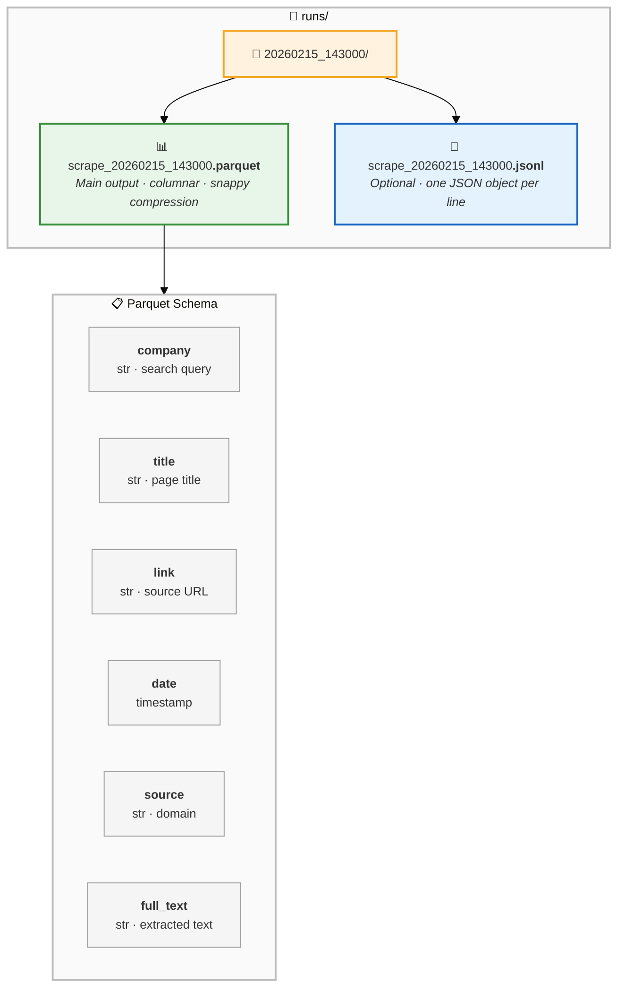
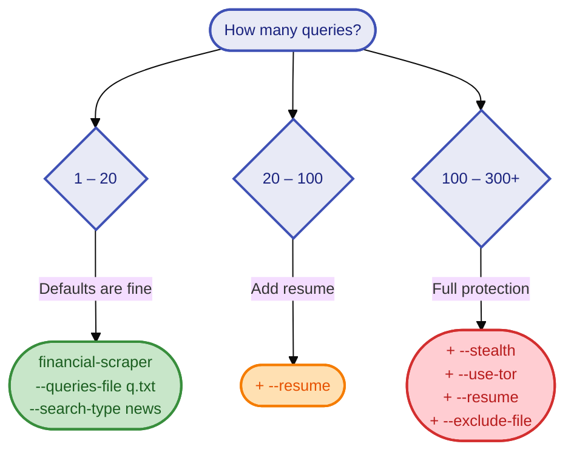
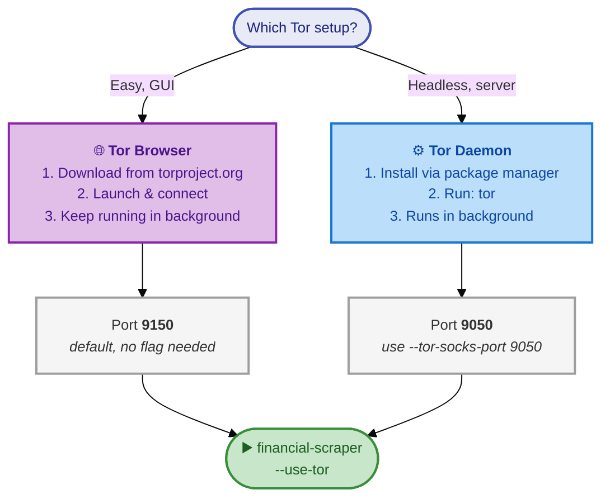
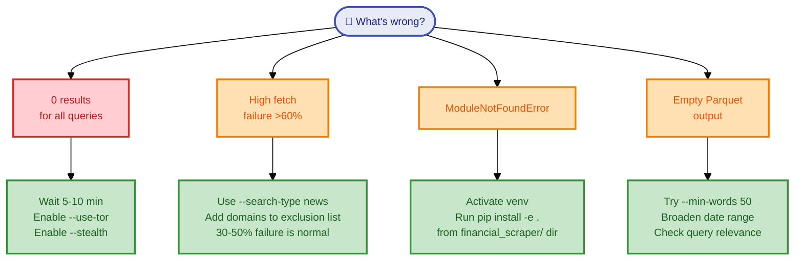

# User Guide

A step-by-step guide to installing, configuring, and running financial-scraper,from your first query to large-scale production runs.

---

## Table of Contents

1. [Prerequisites](#prerequisites)
2. [Installation](#installation)
3. [Your First Scrape](#your-first-scrape)
4. [Understanding the Output](#understanding-the-output)
5. [Writing Good Queries](#writing-good-queries)
6. [Configuration Reference](#configuration-reference)
7. [Scaling Up](#scaling-up)
8. [Using Tor](#using-tor)
9. [URL Deep-Crawl (crawl subcommand)](#url-deep-crawl-crawl-subcommand)
10. [Earnings Transcripts (transcripts subcommand)](#earnings-transcripts-transcripts-subcommand)
11. [Regulatory Filings (sec-filings, uk-filings, fca-nsm, edinet-filings)](#regulatory-filings)
12. [Patents (patents subcommand)](#patents-patents-subcommand)
13. [Supply-Chain Queries (supply-chain subcommand)](#supply-chain-queries-supply-chain-subcommand)
14. [Python API Reference](#python-api-reference)
15. [Troubleshooting & FAQ](#troubleshooting--faq)
16. [Platform Notes](#platform-notes)

---

## Prerequisites

Before installing financial-scraper, make sure you have:

| Requirement | Minimum | Recommended | Check with |
|-------------|---------|-------------|------------|
| Python | 3.10 | 3.11 or 3.12 | `python --version` |
| pip | 21.0+ | latest | `pip --version` |
| git | any | latest | `git --version` |

**Optional:**
- **Tor Browser** or **Tor daemon**,only if you plan to use `--use-tor` for IP rotation
- **pandas**,already included as a dependency, but good to be aware of for analyzing output

### Platform support

| Platform | Status | Notes |
|----------|--------|-------|
| Windows 10/11 | Fully supported | asyncio event loop policy set automatically |
| macOS | Supported | No special configuration needed |
| Linux | Supported | No special configuration needed |

---

## Installation


```mermaid
%%{init: {'theme': 'base', 'themeVariables': {'fontSize': '13px'}}}%%
flowchart LR
    A(["1. Clone repo"]):::blue --> B(["2. Create venv"]):::orange
    B --> C(["3. pip install -e ."]):::purple
    C --> D(["4. Verify\n--help"]):::green

    classDef blue fill:#4a90d9,stroke:#2c5f8a,color:#fff,stroke-width:2px
    classDef orange fill:#f5a623,stroke:#c47d0e,color:#fff,stroke-width:2px
    classDef purple fill:#7b68ee,stroke:#5a4bc7,color:#fff,stroke-width:2px
    classDef green fill:#50c878,stroke:#3a9a5c,color:#fff,stroke-width:2px

    linkStyle 0 stroke:#5c6bc0,stroke-width:3px
    linkStyle 1 stroke:#5c6bc0,stroke-width:3px
    linkStyle 2 stroke:#5c6bc0,stroke-width:3px
```

### Step 1: Clone the repository

```bash
git clone https://github.com/HydrAI/financial-scraper.git
cd financial-scraper
```

### Step 2: Create a virtual environment (recommended)

Using a virtual environment keeps financial-scraper's dependencies isolated from your system Python.

**Windows:**
```bash
python -m venv .venv
.venv\Scripts\activate
```

**macOS / Linux:**
```bash
python3 -m venv .venv
source .venv/bin/activate
```

You'll know it's active when your prompt shows `(.venv)`.

### Step 3: Install the package

```bash
cd financial_scraper
pip install -e .
```

This installs all dependencies and registers the `financial-scraper` CLI command. The `-e` flag means "editable",changes to the source code take effect immediately without reinstalling.

### Step 4: Verify the installation

```bash
python -m financial_scraper --help
```

You should see the full argument list. If you get `ModuleNotFoundError`, make sure your virtual environment is activated and you ran `pip install` from the `financial_scraper/` directory (the one containing `pyproject.toml`).

### Installing dev dependencies (optional)

If you plan to run tests or contribute:

```bash
pip install -e ".[dev]"
python -m pytest tests/ -v
```

### Installing Docling for layout-aware PDF extraction (optional)

Docling provides superior PDF extraction with table detection and hierarchical structure. Without it, PDFs are extracted using pdfplumber (lighter, always available).

```bash
pip install -e ".[docling]"
```

---

## Your First Scrape


```mermaid
%%{init: {'theme': 'base', 'themeVariables': {'fontSize': '13px'}}}%%
flowchart LR
    A(["1. 📝 Write\nqueries.txt"]):::blue --> B(["2. ▶️ Run\nfinancial-scraper"]):::orange
    B --> C(["3. 📊 Watch\nlogs"]):::purple
    C --> D(["4. 📂 Read\nParquet output"]):::green

    classDef blue fill:#4a90d9,stroke:#2c5f8a,color:#fff,stroke-width:2px
    classDef orange fill:#f5a623,stroke:#c47d0e,color:#fff,stroke-width:2px
    classDef purple fill:#7b68ee,stroke:#5a4bc7,color:#fff,stroke-width:2px
    classDef green fill:#50c878,stroke:#3a9a5c,color:#fff,stroke-width:2px

    linkStyle 0 stroke:#5c6bc0,stroke-width:3px
    linkStyle 1 stroke:#5c6bc0,stroke-width:3px
    linkStyle 2 stroke:#5c6bc0,stroke-width:3px
```

### Step 1: Create a query file

Create a file called `queries.txt` with one search query per line:

```text
# My first financial scrape
crude oil futures market outlook
Federal Reserve interest rate decision
Apple quarterly earnings results
```

Lines starting with `#` are comments and will be skipped.

### Step 2: Run the scraper

```bash
financial-scraper --queries-file queries.txt --search-type news --output-dir ./runs
```

This will:
1. Search DuckDuckGo News for each query (up to 20 results per query)
2. Fetch each result page asynchronously with browser fingerprint rotation
3. Check robots.txt before fetching (respects site preferences)
4. Extract clean text using trafilatura (HTML) or pdfplumber/Docling (PDFs)
5. Deduplicate by URL, content hash, and fuzzy near-duplicate detection (MinHash LSH)
6. Save results to a timestamped Parquet file in `./runs/`

### Step 3: What to expect

A typical run with 3 queries takes 2-5 minutes. You'll see log output like:

```
14:30:01 | INFO     | search.duckduckgo       | [1/3] Searching: crude oil futures market outlook
14:30:04 | INFO     | search.duckduckgo       | Found 20 results
14:30:04 | INFO     | fetch.client            | Fetching 20 URLs (concurrency: 10)
14:30:15 | INFO     | fetch.client            | Fetched 14/20 (6 failed)
14:30:15 | INFO     | pipeline                | Extracted 11 documents (min 100 words)
14:30:15 | INFO     | store.output            | Saved 11 rows to runs/20260215_143000/scrape_20260215_143000.parquet
```

**30-50% of fetches will fail.** This is normal. Many financial sites use Cloudflare, bot detection, or paywalls. The scraper logs and skips these gracefully,it does not retry blocked sites.

### Step 4: Read the output

```python
import pandas as pd

df = pd.read_parquet("runs/20260215_143000/scrape_20260215_143000.parquet")
print(f"{len(df)} documents scraped")
print(df[["company", "source", "title"]].head(10))
```

---

## Understanding the Output


```mermaid
%%{init: {'theme': 'base', 'themeVariables': {'fontSize': '13px'}}}%%
flowchart TD
    subgraph output_dir["&nbsp; 📁 runs/ &nbsp;"]
        direction TB
        TS["📁 20260215_143000/"]:::folder
        PQ["📊 scrape_20260215_143000<b>.parquet</b>\n<i>Main output · columnar · snappy compression</i>"]:::parquet
        JL["📄 scrape_20260215_143000<b>.jsonl</b>\n<i>Optional · one JSON object per line</i>"]:::jsonl

        TS --> PQ
        TS --> JL
    end

    PQ --> COLS

    subgraph COLS["&nbsp; 📋 Parquet Schema &nbsp;"]
        direction LR
        C1["<b>company</b>\nstr · search query"]:::col
        C2["<b>title</b>\nstr · page title"]:::col
        C3["<b>link</b>\nstr · source URL"]:::col
        C4["<b>date</b>\ntimestamp"]:::col
        C5["<b>source</b>\nstr · domain"]:::col
        C6["<b>full_text</b>\nstr · extracted text"]:::col
    end

    classDef folder fill:#fff3e0,stroke:#f5a623,stroke-width:2px
    classDef parquet fill:#e8f5e9,stroke:#388e3c,stroke-width:2px
    classDef jsonl fill:#e3f2fd,stroke:#1565c0,stroke-width:2px
    classDef col fill:#f5f5f5,stroke:#9e9e9e,stroke-width:1px

    style output_dir fill:#fafafa,stroke:#bdbdbd,stroke-width:2px
    style COLS fill:#fafafa,stroke:#bdbdbd,stroke-width:2px
```

### Output directory structure

When using `--output-dir`, the scraper creates a timestamped folder:

```
runs/
└── 20260215_143000/
    ├── scrape_20260215_143000.parquet    # Main output
    ├── scrape_20260215_143000.jsonl      # Optional (if --jsonl or --all-formats)
    ├── scrape_20260215_143000.md         # Optional (if --markdown or --all-formats)
    └── markdown/                         # Optional individual per-article .md files
        ├── crude_oil_futures_001.md
        └── crude_oil_futures_002.md
```

When using `--output results.parquet`, it writes directly to that path.

### Parquet schema

| Column | Type | Description | Example |
|--------|------|-------------|---------|
| `company` | string | The search query that produced this result | `crude oil futures market outlook` |
| `title` | string | Page title extracted from HTML | `Oil Futures Rise on Supply Concerns` |
| `link` | string | Source URL | `https://reuters.com/...` |
| `snippet` | string | First 300 characters of extracted text | `Crude oil futures rose 2%...` |
| `date` | timestamp | Publication date (if detected) | `2025-06-15` |
| `source` | string | Domain name | `reuters.com` |
| `full_text` | string | Complete extracted text (cleaned) | Full article text |
| `source_file` | string | Provenance tag for downstream tracking | `scrape_20260215_143000` |

### JSONL format

When `--jsonl` is enabled, each line is a JSON object with the same fields as the Parquet schema. Useful for streaming ingestion or tools that don't support Parquet.

### Markdown format

When `--markdown` is enabled (or `--all-formats`), two sets of files are written:

- **Combined report** (`scrape_<ts>.md`): A single document with a header, article count, and all articles grouped by query. Each article is formatted as a `### title` heading with a metadata table (source, URL, date, word count) followed by the full extracted text.
- **Individual files** (`markdown/<query-slug>_001.md`, etc.): One file per article, useful for further processing or ingestion into document stores.

```bash
# Write all three formats at once
financial-scraper search --queries-file queries.txt --search-type news --all-formats --output-dir ./runs
```

### Typical output sizes

| Queries | Results per query | Expected rows | Parquet size |
|---------|-------------------|---------------|--------------|
| 10 | 20 | 80-120 | 1-5 MB |
| 50 | 20 | 400-600 | 10-30 MB |
| 300 | 20 | 2,000-4,000 | 50-150 MB |

Row count is lower than `queries × results` because of fetch failures, deduplication (exact + fuzzy near-duplicate detection), and minimum word count filtering.

---

## Writing Good Queries

The quality of your output depends heavily on your queries. financial-scraper passes queries directly to DuckDuckGo, so write them the way you'd type them into a search engine.

### Tips for effective queries

| Do | Don't |
|----|-------|
| `crude oil futures market outlook` | `crude oil` (too broad) |
| `Tesla Q3 2025 earnings results` | `TSLA earnings` (ticker-only may miss articles) |
| `SEC 10-K filing risk factors analysis` | `10-K` (too vague) |
| `copper demand supply China 2025` | `copper demand supply forecast analysis report China manufacturing sector` (too long) |

**Aim for 4-8 words per query.** Specific enough to get relevant results, short enough that DuckDuckGo finds matches.

### Search types

| Mode | Flag | Best for | Notes |
|------|------|----------|-------|
| News | `--search-type news` | Financial articles, earnings, market updates | Less rate-limited, more recent content |
| Text | `--search-type text` | Research papers, SEC filings, reference content | Broader results, more rate limiting |

**Recommendation:** Start with `--search-type news` for financial content. Switch to `text` for research or reference material.

### Time filtering

| Flag | Scope |
|------|-------|
| `--timelimit d` | Past day |
| `--timelimit w` | Past week |
| `--timelimit m` | Past month |
| `--timelimit y` | Past year |

### Date filtering (post-extraction)

Use `--date-from` and `--date-to` to keep only pages whose detected publication date falls within a range:

```bash
financial-scraper --queries-file queries.txt --search-type news --date-from 2025-01-01 --date-to 2025-06-30
```

Note: This filters *after* extraction based on the date trafilatura detects in the HTML. Not all pages have detectable dates,those without dates are kept by default.

### Domain exclusions

Create a text file with domains to skip (one per line):

```text
# exclude_domains.txt
facebook.com
twitter.com
linkedin.com
youtube.com
```

Then use `--exclude-file exclude_domains.txt`. The default exclusion list at `config/exclude_domains.txt` blocks 74 domains known to block scrapers or return low-quality content. Use `--no-exclude` to disable it.

---

## Configuration Reference

### ScraperConfig fields

The `ScraperConfig` frozen dataclass holds all settings. Every CLI flag maps to a field:

#### Search settings

| Field | Type | Default | CLI flag | Description |
|-------|------|---------|----------|-------------|
| `queries_file` | `Path` | `queries.txt` | `--queries-file` | Path to query file |
| `max_results_per_query` | `int` | `20` | `--max-results` | Max search results per query |
| `search_delay_min` | `float` | `3.0` | - | Min seconds between search requests |
| `search_delay_max` | `float` | `6.0` | - | Max seconds between search requests |
| `ddg_region` | `str` | `wt-wt` | `--region` | DuckDuckGo region (wt-wt = worldwide) |
| `ddg_timelimit` | `str\|None` | `None` | `--timelimit` | Time filter: d, w, m, y |
| `ddg_backend` | `str` | `auto` | `--backend` | DDG backend: auto, api, html, lite |
| `search_type` | `str` | `text` | `--search-type` | Search mode: text or news |
| `proxy` | `str\|None` | `None` | `--proxy` | HTTP/SOCKS5 proxy URL for searches |

#### Tor settings

| Field | Type | Default | CLI flag | Description |
|-------|------|---------|----------|-------------|
| `use_tor` | `bool` | `False` | `--use-tor` | Route through Tor |
| `tor_socks_port` | `int` | `9150` | `--tor-socks-port` | SOCKS5 port (9150 for Tor Browser, 9050 for daemon) |
| `tor_control_port` | `int` | `9051` | `--tor-control-port` | Control port for circuit renewal |
| `tor_password` | `str` | `""` | `--tor-password` | Control port auth password |
| `tor_renew_every` | `int` | `20` | `--tor-renew-every` | Renew circuit every N queries |
| `tor_renew_on_ratelimit` | `bool` | `True` | - | Auto-renew on 429 responses |

#### Fetch settings

| Field | Type | Default | CLI flag | Description |
|-------|------|---------|----------|-------------|
| `max_concurrent_total` | `int` | `10` | `--concurrent` | Max parallel fetches |
| `max_concurrent_per_domain` | `int` | `3` | `--per-domain` | Max parallel per domain |
| `fetch_timeout` | `int` | `20` | `--timeout` | Fetch timeout in seconds |
| `stealth` | `bool` | `False` | `--stealth` | Enable stealth mode (overrides concurrency/delay) |
| `respect_robots` | `bool` | `True` | `--no-robots` | Check robots.txt before fetching |

#### Crawl settings

| Field | Type | Default | CLI flag | Description |
|-------|------|---------|----------|-------------|
| `crawl` | `bool` | `False` | `--crawl` | Follow links from fetched pages (BFS) |
| `crawl_depth` | `int` | `2` | `--crawl-depth` | Max BFS depth (1 = follow one level of links) |
| `max_pages_per_domain` | `int` | `50` | `--max-pages-per-domain` | Cap pages fetched per domain during crawl |

#### Extract settings

| Field | Type | Default | CLI flag | Description |
|-------|------|---------|----------|-------------|
| `min_word_count` | `int` | `100` | `--min-words` | Minimum words to keep a page |
| `target_language` | `str\|None` | `None` | `--target-language` | ISO language filter (e.g. `en`) |
| `include_tables` | `bool` | `True` | - | Include table text in extraction |
| `favor_precision` | `bool` | `True` | `--no-favor-precision` | Use trafilatura precision mode first |
| `date_from` | `str\|None` | `None` | `--date-from` | Keep pages after YYYY-MM-DD |
| `date_to` | `str\|None` | `None` | `--date-to` | Keep pages before YYYY-MM-DD |

#### Output settings

| Field | Type | Default | CLI flag | Description |
|-------|------|---------|----------|-------------|
| `output_dir` | `Path` | `.` | `--output-dir` | Base dir for timestamped folders |
| `output_path` | `Path` | `output.parquet` | `--output` | Explicit Parquet path |
| `jsonl_path` | `Path\|None` | `None` | `--jsonl` | JSONL output path (auto-generated if flag set) |
| `markdown_path` | `Path\|None` | `None` | `--markdown` | Markdown output path (auto-generated if flag set); `--all-formats` enables both JSONL and Markdown |
| `exclude_file` | `Path\|None` | built-in list | `--exclude-file` | Domain exclusion list (74 domains, `--no-exclude` to disable) |
| `checkpoint_file` | `Path` | `.scraper_checkpoint.json` | `--checkpoint` | Checkpoint file path |
| `resume` | `bool` | `False` | `--resume` | Resume from last checkpoint |
| `reset_queries` | `bool` | `False` | `--reset-queries` | Clear completed queries but keep URL history |

#### Stealth mode overrides

When `stealth=True`, the following defaults are overridden:

| Field | Normal | Stealth |
|-------|--------|---------|
| `max_concurrent_total` | 10 | 4 |
| `max_concurrent_per_domain` | 3 | 2 |
| `search_delay_min` | 3.0s | 5.0s |
| `search_delay_max` | 6.0s | 8.0s |

---

## Scaling Up


```mermaid
%%{init: {'theme': 'base', 'themeVariables': {'fontSize': '13px'}}}%%
flowchart TD
    START(["How many queries?"]):::decision --> SMALL

    SMALL{"1 – 20"}:::decision -->|"Defaults are fine"| CMD1(["financial-scraper\n--queries-file q.txt\n--search-type news"]):::green

    START --> MEDIUM
    MEDIUM{"20 – 100"}:::decision -->|"Add resume"| CMD2(["+ --resume"]):::orange

    START --> LARGE
    LARGE{"100 – 300+"}:::decision -->|"Full protection"| CMD3(["+ --stealth\n+ --use-tor\n+ --resume\n+ --exclude-file"]):::red

    classDef decision fill:#e8eaf6,stroke:#3f51b5,color:#1a237e,stroke-width:2px
    classDef green fill:#c8e6c9,stroke:#388e3c,color:#1b5e20,stroke-width:2px
    classDef orange fill:#ffe0b2,stroke:#f57c00,color:#e65100,stroke-width:2px
    classDef red fill:#ffcdd2,stroke:#d32f2f,color:#b71c1c,stroke-width:2px
```

### Small runs (1-20 queries)

Default settings work fine:

```bash
financial-scraper --queries-file queries.txt --search-type news --output-dir ./runs
```

### Medium runs (20-100 queries)

Add `--resume` so you can restart if interrupted:

```bash
financial-scraper --queries-file queries.txt --search-type news --resume --output-dir ./runs
```

### Large runs (100-300+ queries)

Use stealth mode + Tor + resume for reliability:

```bash
financial-scraper --queries-file queries.txt --search-type news --stealth --use-tor --resume --output-dir ./runs --exclude-file config/exclude_domains.txt --jsonl
```

**Why stealth?** Large runs trigger DuckDuckGo rate limits. Stealth mode reduces concurrency (10→4) and increases delays (3-6s→5-8s) to stay under the radar.

**Why Tor?** Distributes requests across IP addresses. Circuit renews every 20 queries by default, and auto-renews if rate-limited.

**Why resume?** Large runs take 30-60+ minutes. If anything interrupts (network drop, power loss, Ctrl+C), `--resume` picks up from the last completed query instead of restarting.

### Adding deep crawl

Deep crawl multiplies your content by following same-domain links from fetched pages. Add `--crawl` to any of the above:

```bash
# Small run + crawl
financial-scraper --queries-file queries.txt --search-type news --crawl --crawl-depth 1 --max-pages-per-domain 5 --output-dir ./runs

# Large run + crawl + stealth
financial-scraper --queries-file queries.txt --search-type news --crawl --crawl-depth 2 --max-pages-per-domain 10 --stealth --use-tor --resume --output-dir ./runs --exclude-file config/exclude_domains.txt --jsonl
```

**How it works:** After fetching depth-0 pages (search results), the pipeline extracts `<a href>` links from the HTML, filters to same base domain (e.g., `blog.reuters.com` links are kept when coming from `reuters.com`), and queues them for the next depth. This repeats until `crawl_depth` is reached.

**Caps:** `max_pages_per_domain` limits how many pages are fetched per domain across all depths. The total crawl URLs per depth are also capped to prevent runaway crawls on link-heavy news sites.

### Monitoring progress

The scraper logs each query as it processes. Watch for:

- `Found N results`,how many URLs DuckDuckGo returned
- `Fetched X/Y (Z failed)`,fetch success rate
- `Extracted N documents`,how many passed word count filter
- `Saved N rows`,final rows written to Parquet

If you see `Found 0 results` repeatedly, DuckDuckGo may be rate-limiting you. Wait 5-10 minutes or enable Tor.

---

## Using Tor

Tor routes your requests through the Tor network, providing IP rotation and privacy.


```mermaid
%%{init: {'theme': 'base', 'themeVariables': {'fontSize': '13px'}}}%%
flowchart TD
    START(["Which Tor setup?"]):::decision

    START -->|"Easy, GUI"| BROWSER["🌐 <b>Tor Browser</b>\n1. Download from torproject.org\n2. Launch & connect\n3. Keep running in background"]:::purple
    START -->|"Headless, server"| DAEMON["⚙️ <b>Tor Daemon</b>\n1. Install via package manager\n2. Run: tor\n3. Runs in background"]:::blue

    BROWSER --> PORT1["Port <b>9150</b>\n<i>default, no flag needed</i>"]:::grey
    DAEMON --> PORT2["Port <b>9050</b>\n<i>use --tor-socks-port 9050</i>"]:::grey

    PORT1 --> RUN(["▶️ financial-scraper\n--use-tor"]):::green
    PORT2 --> RUN

    classDef decision fill:#e8eaf6,stroke:#3f51b5,color:#1a237e,stroke-width:2px
    classDef purple fill:#e1bee7,stroke:#8e24aa,color:#4a148c,stroke-width:2px
    classDef blue fill:#bbdefb,stroke:#1976d2,color:#0d47a1,stroke-width:2px
    classDef grey fill:#f5f5f5,stroke:#9e9e9e,stroke-width:2px
    classDef green fill:#c8e6c9,stroke:#388e3c,color:#1b5e20,stroke-width:2px
```

### Setup

**Option A: Tor Browser (easiest)**

1. Download and install [Tor Browser](https://www.torproject.org/download/)
2. Launch Tor Browser and let it connect
3. Keep it running in the background,it listens on SOCKS5 port `9150`

**Option B: Tor daemon (headless)**

1. Install Tor:
   - Windows: download the Expert Bundle from torproject.org
   - macOS: `brew install tor`
   - Linux: `sudo apt install tor`
2. Start the daemon: `tor` (listens on SOCKS5 port `9050`)
3. Use `--tor-socks-port 9050` instead of the default `9150`

### Running with Tor

```bash
# With Tor Browser running
financial-scraper --queries-file queries.txt --use-tor --output-dir ./runs
```

```bash
# With Tor daemon (different port)
financial-scraper --queries-file queries.txt --use-tor --tor-socks-port 9050 --output-dir ./runs
```

### Circuit renewal

By default, the Tor circuit (IP address) renews every 20 queries. You can adjust this:

```bash
# Renew every 10 queries (more frequent IP changes)
financial-scraper --queries-file queries.txt --use-tor --tor-renew-every 10
```

The scraper also auto-renews the circuit when it receives a 429 (rate limit) response.

### Tor + Stealth (recommended for large runs)

```bash
financial-scraper --queries-file queries.txt --use-tor --stealth --resume --output-dir ./runs
```

---

## URL Deep-Crawl (`crawl` subcommand)

The `crawl` subcommand provides a different mode of operation: instead of searching DDG for queries, it takes a file of seed URLs and deep-crawls each one using crawl4ai's headless browser.

### When to use `crawl` vs `search`

| Use case | Subcommand |
|----------|------------|
| Discover content from keyword queries | `search` |
| Crawl specific domains/pages you already know | `crawl` |
| JS-rendered sites that block simple HTTP fetches | `crawl` |
| Follow internal links on a corporate site | `crawl` |
| Broad financial news gathering | `search` |

### Installation

The crawl subcommand requires crawl4ai as an optional dependency:

```bash
pip install -e ".[crawl]"
```

### Seed URL file format

Create a text file with one URL per line. Comments (`#`) and blank lines are skipped:

```text
# Financial news
https://reuters.com/business
https://bloomberg.com/markets

# Company pages
https://investor.apple.com
```

### Basic usage

```bash
financial-scraper crawl --urls-file seed_urls.txt --output-dir ./runs
```

This will:
1. Open each seed URL in a headless browser via crawl4ai
2. Discover internal links using BFS with financial-keyword scoring
3. Crawl up to `--max-pages` pages per seed, up to `--max-depth` levels deep
4. Extract content using trafilatura (HTML) or pdfplumber/Docling (PDFs detected by URL or content-type)
5. Deduplicate and write to Parquet

### Key options

| Flag | Default | Description |
|------|---------|-------------|
| `--max-depth N` | `2` | How many link levels deep to follow |
| `--max-pages N` | `50` | Max pages discovered per seed URL |
| `--semaphore-count N` | `2` | Concurrent browser tabs |
| `--pdf-extractor {auto,docling,pdfplumber}` | `auto` | PDF extraction backend |
| `--stealth` | off | Reduce concurrency to 1 |

### PDF extraction

When the crawl pipeline encounters a PDF URL (detected by `.pdf` extension or `application/pdf` content-type header), it downloads the file directly and extracts text using the configured PDF backend. Two backends are available:

| Backend | Install | Strengths |
|---------|---------|-----------|
| **pdfplumber** | Always installed | Lightweight, fast, reliable for text-based PDFs |
| **Docling** | `pip install -e ".[docling]"` | Layout-aware, table detection, hierarchical structure, better for complex PDFs |

```bash
# Auto (default): uses Docling if installed, falls back to pdfplumber
financial-scraper crawl --urls-file seed_urls.txt --max-depth 2 --output-dir ./runs

# Explicitly use Docling for complex PDFs (SEC filings, annual reports)
financial-scraper crawl --urls-file seed_urls.txt --max-depth 2 --pdf-extractor docling --output-dir ./runs

# Explicitly use pdfplumber (lighter, no ML dependencies)
financial-scraper crawl --urls-file seed_urls.txt --max-depth 2 --pdf-extractor pdfplumber --output-dir ./runs
```

Seed URLs can point directly to PDF files. PDF and HTML results use the same Parquet output schema, so they can be analyzed together.

### How scoring works

crawl4ai's BFS expander scores discovered URLs before deciding which to visit next. The crawl pipeline uses a composite scorer with:

- **Financial keyword relevance** (weight 0.8) — URLs containing words like `earnings`, `quarterly`, `report`, `sec`, `filings` score higher
- **Path depth** (weight 0.3) — shorter paths (closer to site root) are preferred
- **Freshness** (weight 0.15) — URLs containing the current year score higher

URLs matching common non-content patterns (login, contact, career, legal, privacy, etc.) are filtered out before scoring.

### Output format

The output uses the same Parquet schema as search mode. The `company` field is set to the seed URL's domain (e.g. `reuters.com`), and the `source_file` tag uses the `crawl` prefix:

```
reuters_com_crawl_2026Q1.parquet
```

### CrawlConfig fields

| Field | Type | Default | CLI flag |
|-------|------|---------|----------|
| `urls_file` | `Path` | `urls.txt` | `--urls-file` |
| `exclude_file` | `Path\|None` | `None` | `--exclude-file` |
| `max_depth` | `int` | `2` | `--max-depth` |
| `max_pages` | `int` | `50` | `--max-pages` |
| `semaphore_count` | `int` | `2` | `--semaphore-count` |
| `pdf_extractor` | `str` | `"auto"` | `--pdf-extractor` |
| `min_word_count` | `int` | `100` | `--min-words` |
| `check_robots_txt` | `bool` | `True` | `--no-robots` |
| `stealth` | `bool` | `False` | `--stealth` |
| `resume` | `bool` | `False` | `--resume` |
| `checkpoint_file` | `Path` | `.crawl_checkpoint.json` | `--checkpoint` |

### Python API

```python
import asyncio
from pathlib import Path
from financial_scraper.crawl.config import CrawlConfig
from financial_scraper.crawl.pipeline import CrawlPipeline

config = CrawlConfig(
    urls_file=Path("seed_urls.txt"),
    max_depth=2,
    max_pages=50,
    output_dir=Path("./runs"),
    output_path=Path("./runs/crawl_output.parquet"),
)

pipeline = CrawlPipeline(config)
asyncio.run(pipeline.run())
```

---

## Earnings Transcripts (`transcripts` subcommand)

The `transcripts` subcommand downloads structured earnings call transcripts from multiple sources. The built-in pipeline discovers transcript URLs via Motley Fool sitemaps, fetches and extracts full transcript content (speakers, prepared remarks, Q&A), and outputs to Parquet. Standalone backfill scripts extend coverage to AlphaStreet, Seeking Alpha (via Wayback Machine), and archived Motley Fool pages (via Wayback Machine) for broader historical reach.

### Coverage overview

| Source | Coverage | Transcripts | Strengths |
|--------|----------|-------------|-----------|
| Motley Fool (built-in pipeline) | 2013-2026 | 14,737 | Primary source, best for recent years |
| Seeking Alpha via Wayback Machine | 2007-2023 | 8,278 | Best for historical transcripts pre-2019 |
| AlphaStreet (standalone script) | 2019-2026 | 2,236 | High hit rate, good for recent gaps |
| Research4 text files | 2015-2020 | 1,655 | S&P 500 transcripts |
| Motley Fool via Wayback Machine | 2017-2020 | 892+ | Archived Fool pages not in current sitemaps |

Combined coverage spans **2006-2026** with **27,800+ transcripts** across **1,425 tickers** (94.3% of US10002 universe). A two-round quality pipeline ensures clean data with 0 HTML artifacts, 0 encoding issues, 0 misassigned tickers, and 0 short stubs.

### When to use `transcripts`

| Use case | Subcommand |
|----------|------------|
| Discover content from keyword queries | `search` |
| Crawl specific domains/pages you already know | `crawl` |
| Download earnings call transcripts by ticker | `transcripts` |

### Basic usage

```bash
# Download all 2025 transcripts for Apple
python -m financial_scraper transcripts --tickers AAPL --year 2025 --output-dir ./runs

# Multiple tickers, specific quarters
python -m financial_scraper transcripts --tickers AAPL MSFT NVDA --quarters Q1 Q4 --output-dir ./runs

# With JSONL output
python -m financial_scraper transcripts --tickers AAPL --year 2025 --jsonl --output-dir ./runs

# From a file of tickers (one per line, supports 1,500+ tickers)
python -m financial_scraper transcripts --tickers-file tickers.txt --year 2025 --output-dir ./runs
```

### How it works

1. **Discovery**: Scans Motley Fool monthly XML sitemaps (`fool.com/sitemap/YYYY/MM`) for transcript URLs containing the target ticker
2. **Fetch**: Downloads each transcript page with polite 1.5s delays
3. **Extract**: Parses HTML for metadata (JSON-LD), participants, speakers, full transcript text, and splits into prepared remarks vs Q&A
4. **Dedup + Store**: Deduplicates by `(ticker, year, quarter)` — keeps first occurrence, writes to Parquet

### Large-scale runs

For bulk transcript collection across many tickers, use a tickers file and checkpoint/resume:

```bash
# Large run with resume (safe to interrupt and restart)
python -m financial_scraper transcripts --tickers-file config/us10002_active_tickers.txt --year 2025 --resume --output-dir ./runs

# Resume after interruption
python -m financial_scraper transcripts --tickers-file config/us10002_active_tickers.txt --year 2025 --resume --output-dir ./runs
```

For historical backfill beyond what the built-in Motley Fool pipeline covers, standalone scripts fill gaps from additional sources:

| Script | Source | Purpose |
|--------|--------|---------|
| `_fill_alphastreet_gaps.py` | AlphaStreet sitemaps | 2019-2026 gaps |
| `_fill_wayback_gaps.py` | Seeking Alpha via Wayback CDX | Historical pre-2019 |
| `_fill_wayback_fool_gaps.py` | Motley Fool via Wayback CDX | Archived Fool pages 2017-2020 |
| `_fill_fmp_gaps.py` | FMP API | All years (requires paid key) |

After fetching, merge and clean with:
```bash
python _merge_parquets.py          # Combine all sources, dedup by (company, year, quarter)
python _fix_parquet_issues.py      # Fix dates, remove paywall stubs, clean boilerplate
python _fix_deep_issues.py         # Fix misassigned tickers, HTML/encoding, year mismatches
```

### Output format

The output uses the same Parquet schema as search and crawl modes:

| Column | Example value |
|--------|---------------|
| `company` | `AAPL` |
| `title` | `AAPL Q1 2025 Earnings Call Transcript` |
| `link` | `https://www.fool.com/earnings/call-transcripts/2025/01/30/apple-aapl-q1-2025-...` |
| `date` | `2025-01-30` |
| `source` | `fool.com` |
| `full_text` | Full transcript (typically 5,000-10,000+ words) |
| `source_file` | `AAPL_transcript_Q1_2025.parquet` |

The `source` field indicates provenance: `fool.com`, `alphastreet.com`, `seekingalpha.com (wayback)`, `seekingalpha.com (research4)`, or `fool.com (wayback)`.

### Key options

| Flag | Default | Description |
|------|---------|-------------|
| `--tickers AAPL MSFT` | (required) | Ticker symbols to search |
| `--tickers-file FILE` | None | File with tickers (one per line) |
| `--year N` | current year | Fiscal year to search |
| `--quarters Q1 Q2 ...` | all | Filter to specific quarters |
| `--concurrent N` | 5 | Max parallel requests |
| `--jsonl` | off | Also write JSONL output |
| `--resume` | off | Resume from checkpoint |
| `--reset` | off | Delete checkpoint before running |

### Python API

```python
from pathlib import Path
from financial_scraper.transcripts import TranscriptConfig, TranscriptPipeline

config = TranscriptConfig(
    tickers=("AAPL", "MSFT"),
    year=2025,
    quarters=("Q1",),
    output_dir=Path("./runs"),
    output_path=Path("./runs/transcripts.parquet"),
)

pipeline = TranscriptPipeline(config)
pipeline.run()  # Synchronous — no asyncio.run() needed
```

---

## Regulatory Filings

Five subcommands pull annual reports directly from the authoritative regulator/registry endpoints instead of discovering them via search. Each reads a company-list CSV, queries the source API, downloads the filings, extracts text, and writes a single parquet plus a `raw/` directory of source files.

### Which one to use

| Subcommand | Source | Scope | Text quality |
|------------|--------|-------|--------------|
| `sec-filings` | SEC EDGAR | US 10-K / 20-F (incl. non-US ADR issuers via `--isin-column`) | Excellent — publisher HTML |
| `uk-filings` | UK Companies House | CH statutory accounts | Poor-to-medium — many legacy PDFs are scanned images |
| `fca-nsm` | FCA National Storage Mechanism | UK listed-issuer DTR 6.4 annual reports | Excellent — iXBRL / publisher PDFs |
| `edinet-filings` | EDINET (Japan) | Japanese annual securities reports | Excellent |
| `patents` | Google Patents / BigQuery | Patent metadata + claims | N/A |

**For UK companies**: prefer `fca-nsm` (text-extractable, iXBRL ESEF packages) over `uk-filings` (CH scans). Use `sec-filings --isin-column` first for the ~26/300 dual-listed issuers with US ADRs, then `fca-nsm` for the remainder.

### Shared CLI conventions

All five subcommands share these flags:

| Flag | Purpose |
|------|---------|
| `--csv FILE` | Company list (required) |
| `--company-column NAME` | CSV column containing company names |
| `--country-column NAME` | CSV column containing country codes (optional filter) |
| `--country-filter CODE` | Process only rows matching this country code (e.g. `GB`) |
| `--limit-companies N` | Process only the first N rows after filtering |
| `--skip-companies N` | Skip the first N rows (for sharding) |
| `--max-filings N` | Cap filings per company (`0` = all, recommended: 3-5) |
| `--output-dir DIR` | Output directory (parquet + `raw/` subdir + checkpoint) |
| `--resume` | Resume from the per-run checkpoint file |

Incremental writes + checkpointing means you can safely interrupt (`Ctrl+C`) and resume any run.

### SEC EDGAR (`sec-filings`)

Downloads 10-K (US domestic) and 20-F (foreign private issuer) filings from SEC EDGAR by ticker. Resolves ticker → CIK → filings index → primary document.

```bash
# Direct US tickers
python -m financial_scraper sec-filings \
  --csv kg_liquid_companies.csv \
  --ticker-column ticker --company-column company_name \
  --max-filings 5 --output-dir sec_filings_us
```

For non-US companies listed on US exchanges via ADR, pass `--isin-column` and the scraper will resolve ISINs to their US ticker via OpenFIGI. When `--isin-column` is set, the ISIN is **authoritative** — this prevents wrong-company matches on generic tickers (e.g. `BP`, `BT`) by ignoring the CSV's ticker column in favor of the OpenFIGI-resolved one.

```bash
python -m financial_scraper sec-filings \
  --csv kg_liquid_companies.csv \
  --isin-column isin --company-column company_name \
  --country-column country_code --country-filter GB \
  --max-filings 5 --output-dir sec_filings_uk_adrs
```

**Coverage limitation**: on a 300-GB-company universe, ADR resolution via SEC only reaches ~26 genuinely dual-listed issuers. Use `fca-nsm` for the other ~274.

### UK Companies House (`uk-filings`)

Downloads statutory accounts directly from Companies House via the CH REST API. Requires a free CH API key.

```bash
export COMPANIES_HOUSE_API_KEY=...   # or pass --ch-api-key
python -m financial_scraper uk-filings \
  --csv kg_liquid_companies.csv \
  --company-column company_name --company-number-column company_number \
  --country-column country_code --country-filter GB \
  --max-filings 3 --output-dir uk_filings
```

**Scope caveat**: CH hosts the *statutory* filing, which for pre-iXBRL years is often a scanned-image PDF unsuitable for text extraction. For listed-issuer annual reports (LSE Main Market, AIM), the regulated DTR 6.4 filing in the FCA NSM is text-extractable and should be preferred — see `fca-nsm` below.

### FCA National Storage Mechanism (`fca-nsm`)

Downloads UK listed-issuer annual reports from the FCA NSM, the official DTR 6.4 repository. Queries the Elasticsearch endpoint the NSM portal SPA uses (`api.data.fca.org.uk/search`).

```bash
python -m financial_scraper fca-nsm \
  --csv kg_liquid_companies.csv \
  --company-column company_name \
  --country-column country_code --country-filter GB \
  --max-filings 5 --output-dir fca_nsm_uk --resume
```

**Three payload types**, auto-detected by magic bytes:

| Kind | Extraction path | Typical size | Typical words |
|------|-----------------|--------------|---------------|
| `pdf` | `pdfplumber` | 2-12 MB | 80k-200k |
| `zip` (ESEF iXBRL) | Unzipped, largest `.xhtml` parsed with `lxml.etree` (recover + huge_tree) | 30-120 MB | 150k-400k |
| `html` (RNS) | `trafilatura` | <100 KB | 100-10k (often short announcement stub) |

The ESEF iXBRL path is the gold standard — publisher-produced, machine-readable single-file reports. Some of them are 100+ MB single-file XHTML that defeat `trafilatura` and `lxml.html`; the `lxml.etree` path with `huge_tree=True` and `recover=True` handles them.

**Name matching**: the FCA's Elasticsearch `company` criterion is deliberately loose (e.g. a BP-only query can match UBS ETFs with "BP" in their name). A post-hoc fuzzy name filter normalises corporate suffixes and requires a distinctive-token match plus ≥50% token overlap before accepting a hit.

**Optional filters:**

| Flag | Default | Description |
|------|---------|-------------|
| `--lei-column NAME` | — | CSV column for LEI — exact LEI match, preferred over name fuzzy-match |
| `--headline STR` | `"Annual Financial Report"` | Headline substring filter; pass `""` for all disclosures |
| `--from-date DD/MM/YYYY` | — | Publication date lower bound |
| `--to-date DD/MM/YYYY` | — | Publication date upper bound |

**Full-GB run benchmark** (300 companies from `kg_liquid_companies_prod_fid.csv`, `--max-filings 5`, Apr 2026):

| Metric | Value |
|---|---|
| Runtime | 108 minutes |
| Companies matched | 213 / 300 (71%) |
| Companies with ≥1 substantive report (≥10k words) | 111 / 300 (37%) |
| Reports downloaded | 840 |
| Total extracted words | 40.8M |
| Mean words by kind | html: 3.7k, pdf: 128k, **zip: 244k** |

The 29% no-hit rate is dominated by AIM-listed / sub-threshold issuers not subject to DTR 6.4, plus occasional name-normalization misses.

### EDINET (`edinet-filings`)

Downloads annual securities reports (有価証券報告書) from EDINET, Japan's equivalent of EDGAR. Requires a free EDINET API key.

```bash
export EDINET_API_KEY=...   # or pass --edinet-api-key
python -m financial_scraper edinet-filings \
  --csv kg_liquid_companies.csv \
  --company-column company_name --ticker-column ticker \
  --scan-days 730 --max-filings 3 --output-dir edinet_jp
```

`--scan-days` controls how far back the daily-disclosure index is scanned (default 730 = ~2 years) to find filings matching the target companies.

### Output format

All four regulatory-filing subcommands write a single parquet with a consistent schema:

| Column | Description |
|--------|-------------|
| `csv_company` | Company name from the input CSV |
| `csv_lei` / `csv_ticker` | Identifier from the input CSV |
| `hit_company` / `hit_lei` | Identifier as matched on the source |
| `headline` / `type` | Filing headline and type code |
| `document_date` / `publication_date` | Filing dates |
| `source` | Source API (`sec-filings`, `uk-filings`, `fca-nsm`, `edinet-filings`) |
| `download_url` | Original download URL |
| `file_kind` | `pdf` / `zip` / `html` |
| `file_size_mb` | Raw file size |
| `full_text` | Extracted text |
| `words` | Word count |

Raw downloaded files are kept in `<output-dir>/raw/` for re-extraction or auditing.

---

## Patents (`patents` subcommand)

Discover and fetch patent data by assignee, topic keywords, or explicit patent IDs. Two data sources:

- **Google Patents** (default, free): web-scraping the public Google Patents front-end
- **BigQuery** (`--source bigquery`): the Google Public Data `patents-public-data` dataset — much faster for bulk assignee lookups but requires a GCP project and incurs query costs

**Scope note**: this module is data-acquisition only. Pre-canned regex supply-chain signal extraction was intentionally removed — LLM-based extraction happens in a separate downstream KG project.

### Discovery modes

**By assignee** (most common):

```bash
python -m financial_scraper patents \
  --assignee "Droneshield LLC" --company "DroneShield" \
  --max-discovery 50 --output-dir patent_data
```

**By topic keywords**:

```bash
python -m financial_scraper patents \
  --search-queries "drone acoustic detection patent" "counter-UAS acoustic" \
  --company "topic-drones" --max-discovery 100 --output-dir patent_data
```

**By explicit IDs** (when you already have a list):

```bash
python -m financial_scraper patents \
  --ids-file my_patent_ids.txt --company "MyCorp" --output-dir patent_data
```

**Batch mode** (multiple companies or themes from a JSON config):

```bash
python -m financial_scraper patents \
  --targets-file config/patent_targets.json --output-dir patent_data
```

### Classification filters

Restrict to patents matching CPC, IPC, or WIPO technology-category codes:

```bash
# CPC prefixes (e.g. radar + wireless comms)
python -m financial_scraper patents --assignee "Raytheon Technologies" \
  --cpc-filter G01S H04 --max-discovery 200 --output-dir patent_data

# List available WIPO categories
python -m financial_scraper patents --list-wipo-categories
```

### BigQuery source (large-scale)

For pulling patents across hundreds of assignees, BigQuery is much faster. Always dry-run first to estimate cost:

```bash
python -m financial_scraper patents --source bigquery \
  --bq-csv kg_liquid_companies.csv --bq-company-column company_name \
  --bq-country US --bq-dry-run
```

Remove `--bq-dry-run` to execute. Add `--bq-include-description` only when you need full claim text (much larger output).

---

## Supply-Chain Queries (`supply-chain` subcommand)

Generates 5 supply-chain-focused search queries per company from a CSV (e.g. "`<company>` suppliers", "`<company>` customers", "`<company>` manufacturing partners"), then runs them through the standard `ScraperPipeline`. Useful for bulk-building supplier/customer corpora for downstream analysis.

```bash
python -m financial_scraper supply-chain \
  --csv kg_liquid_companies.csv \
  --company-column company_name --ticker-column ticker \
  --limit-companies 100 --max-results 10 \
  --output-dir supply_chain_top100 --resume
```

Inherits all search/fetch/Tor/throttle flags from the main `search` subcommand, including `--save-raw` to persist source PDFs/HTML alongside the parquet.

---

## Python API Reference

### Basic usage

```python
import asyncio
from pathlib import Path
from financial_scraper import ScraperConfig, ScraperPipeline

config = ScraperConfig(
    queries_file=Path("queries.txt"),
    search_type="news",
    max_results_per_query=10,
)

pipeline = ScraperPipeline(config)
asyncio.run(pipeline.run())
```

### Custom configuration

```python
config = ScraperConfig(
    queries_file=Path("queries.txt"),
    search_type="news",
    max_results_per_query=20,
    output_dir=Path("./runs"),
    # Stealth mode for large runs
    stealth=True,
    # Date filtering
    date_from="2025-01-01",
    date_to="2025-12-31",
    # Resume support
    resume=True,
    # JSONL output (auto-resolved when using CLI, manual when using API)
    jsonl_path=Path("./runs/output.jsonl"),
    # Domain exclusions
    exclude_file=Path("config/exclude_domains.txt"),
)
```

### Deep crawl from Python

```python
config = ScraperConfig(
    queries_file=Path("queries.txt"),
    search_type="news",
    max_results_per_query=5,
    # Enable crawl: follow same-domain links from fetched pages
    crawl=True,
    crawl_depth=1,                  # Follow links one level deep
    max_pages_per_domain=5,         # Cap per domain to avoid runaway crawls
    output_dir=Path("./runs"),
    exclude_file=Path("config/exclude_domains.txt"),
)
```

### Re-running queries from Python

```python
config = ScraperConfig(
    queries_file=Path("queries.txt"),
    search_type="news",
    # Resume loads the checkpoint (URL history, stats)
    resume=True,
    # Reset queries clears completed queries but keeps URL dedup
    reset_queries=True,
    output_dir=Path("./runs"),
)
```

### Using Tor from Python

```python
config = ScraperConfig(
    queries_file=Path("queries.txt"),
    search_type="news",
    use_tor=True,
    tor_socks_port=9150,       # 9150 for Tor Browser, 9050 for daemon
    tor_control_port=9051,
    tor_renew_every=15,         # Renew circuit every 15 queries
)
```

### Stealth mode internals

When you set `stealth=True`, the pipeline calls `apply_stealth()` which creates a new config with overrides. The original config is not mutated (frozen dataclass):

```python
from financial_scraper.config import ScraperConfig, apply_stealth

config = ScraperConfig(stealth=True)
actual_config = apply_stealth(config)
print(actual_config.max_concurrent_total)       # 4 (was 10)
print(actual_config.max_concurrent_per_domain)   # 2 (was 3)
print(actual_config.search_delay_min)            # 5.0 (was 3.0)
```

### Windows event loop

The CLI entry point (`main.py`) automatically sets `WindowsSelectorEventLoopPolicy` on Windows. If you're using the Python API directly, add this before `asyncio.run()`:

```python
import sys, asyncio
if sys.platform.startswith("win"):
    asyncio.set_event_loop_policy(asyncio.WindowsSelectorEventLoopPolicy())
```

---

## Troubleshooting & FAQ


```mermaid
%%{init: {'theme': 'base', 'themeVariables': {'fontSize': '12px'}}}%%
flowchart TD
    PROBLEM(["🔧 What's wrong?"]):::decision

    PROBLEM --> Z["0 results\nfor all queries"]:::red
    PROBLEM --> F["High fetch\nfailure >60%"]:::orange
    PROBLEM --> M["ModuleNotFoundError"]:::orange
    PROBLEM --> E["Empty Parquet\noutput"]:::orange

    Z --> Z_FIX["Wait 5-10 min\nEnable --use-tor\nEnable --stealth"]:::green
    F --> F_FIX["Use --search-type news\nAdd domains to exclusion list\n30-50% failure is normal"]:::green
    M --> M_FIX["Activate venv\nRun pip install -e .\nfrom financial_scraper/ dir"]:::green
    E --> E_FIX["Try --min-words 50\nBroaden date range\nCheck query relevance"]:::green

    classDef decision fill:#e8eaf6,stroke:#3f51b5,color:#1a237e,stroke-width:2px
    classDef red fill:#ffcdd2,stroke:#d32f2f,color:#b71c1c,stroke-width:2px
    classDef orange fill:#ffe0b2,stroke:#f57c00,color:#e65100,stroke-width:2px
    classDef green fill:#c8e6c9,stroke:#388e3c,color:#1b5e20,stroke-width:2px
```

### "Found 0 results" for every query

**Cause:** DuckDuckGo is rate-limiting your IP.

**Fix:**
- Wait 5-10 minutes before retrying
- Enable Tor: `--use-tor`
- Use stealth mode: `--stealth`
- Reduce `--max-results` to 10

### High fetch failure rate (>60%)

**Cause:** Many financial sites block automated access (Cloudflare, CAPTCHAs, paywalls).

**Fix:**
- This is partially expected (30-50% failure is normal)
- Add problematic domains to your exclusion file
- Use `--search-type news` (news sites tend to be more accessible)
- Try `--stealth` mode

### "ModuleNotFoundError: No module named 'financial_scraper'"

**Fix:**
- Make sure your virtual environment is activated
- Run `pip install -e .` from the `financial_scraper/` directory (the one with `pyproject.toml`)
- Verify with `pip list | grep financial`

### "Access is denied" when running `financial-scraper` on Windows

**Cause:** Windows script wrapper permission issue.

**Fix:** Use `python -m financial_scraper` instead:

```bash
python -m financial_scraper --queries-file queries.txt --search-type news
```

### Scraper hangs / no output

**Possible causes:**
- Tor not running (if `--use-tor` is set),start Tor Browser or daemon first
- All domains are blocked or rate-limited,wait and retry, or use different queries
- Network connectivity issue,check `ping duckduckgo.com`

### How do I resume a failed run?

Add `--resume` to your command. The scraper saves a checkpoint after each completed query. On resume, it skips already-completed queries and continues from where it left off.

```bash
# First run (interrupted)
financial-scraper --queries-file queries.txt --output-dir ./runs

# Resume
financial-scraper --queries-file queries.txt --output-dir ./runs --resume
```

The checkpoint file (`.scraper_checkpoint.json`) is saved in the current directory by default. Use `--checkpoint path/to/file.json` to customize.

### How do I re-run the same queries?

If all queries are marked "done" in the checkpoint, `--resume` will skip everything. Use one of these flags:

```bash
# Re-run all queries but skip already-fetched URLs (smart re-run)
financial-scraper --queries-file queries.txt --resume --reset-queries --output-dir ./runs

# Full reset — delete checkpoint entirely and start fresh
financial-scraper --queries-file queries.txt --reset --output-dir ./runs
```

**When to use which:**
- `--reset-queries`: Re-searches all queries but won't re-fetch URLs already in the checkpoint. Best for getting new search results while avoiding duplicate fetches.
- `--reset`: Deletes the checkpoint file completely. Use when you want a fully clean slate.

### Can I use a proxy instead of Tor?

Yes. Use `--proxy` with any HTTP or SOCKS5 proxy:

```bash
financial-scraper --queries-file queries.txt --proxy socks5://127.0.0.1:1080
```

### How do I scrape in a specific language?

Use `--target-language` with an ISO code:

```bash
financial-scraper --queries-file queries.txt --target-language en
```

This tells trafilatura to prefer content in that language. Note: DuckDuckGo results depend on `--region`, so set that too (e.g., `--region de-de` for German results).

### Output Parquet file is empty

**Possible causes:**
- All extracted texts were below `--min-words` (default: 100),try `--min-words 50`
- All results were duplicates of previously seen content
- Date filter (`--date-from`/`--date-to`) excluded everything,broaden the range or remove the filter

### PDF download fails with content encoding error

**Cause:** The server responds with Brotli compression, which aiohttp cannot decode without the optional `brotli` Python package.

**Fix:** This is already handled in the crawl pipeline — it sends `Accept-Encoding: gzip, deflate` to avoid Brotli responses. If you see this error in a custom setup, either install `pip install brotli` or add the `Accept-Encoding: gzip, deflate` header to your requests manually.

---

## Platform Notes

### Windows

- **asyncio:** The CLI automatically sets `WindowsSelectorEventLoopPolicy`. No manual configuration needed.
- **Paths:** Use forward slashes or raw strings: `--queries-file queries.txt` or `--queries-file C:/Users/me/queries.txt`
- **Tor Browser:** Default port is 9150. Make sure it's running before using `--use-tor`.
- **Script wrapper:** If `financial-scraper` gives "Access is denied", use `python -m financial_scraper` instead.
- **crawl subcommand (crawl4ai):** crawl4ai's logger uses Unicode characters that can crash on legacy Windows terminals (cp1252). Set `PYTHONUTF8=1` before running:
  ```bash
  set PYTHONUTF8=1
  python -m financial_scraper crawl --urls-file urls.txt --output-dir ./runs
  ```
  Or in PowerShell: `$env:PYTHONUTF8="1"`

### macOS

- **Tor:** Install via `brew install tor`, or use Tor Browser.
- No other special configuration needed.

### Linux

- **Tor:** Install via your package manager (`apt install tor`, `dnf install tor`, etc.)
- **Permissions:** If running as a service, make sure the user has write access to the output directory.

---

## Next Steps

- Run the **[Example Notebooks](../financial_scraper/examples/)** for hands-on walkthroughs of all 3 modes:
  - [01_search_text.ipynb](../financial_scraper/examples/01_search_text.ipynb) — Text search for broad research content
  - [02_search_news.ipynb](../financial_scraper/examples/02_search_news.ipynb) — News search for recent financial articles
  - [03_crawl_urls.ipynb](../financial_scraper/examples/03_crawl_urls.ipynb) — Deep-crawl specific URLs with headless browser
  - [04_transcripts.ipynb](../financial_scraper/examples/04_transcripts.ipynb) — Download earnings call transcripts by ticker
- See the **[CLI Cookbook](cli-examples.md)** for copy-paste commands covering every query file and use case
- Browse [example query files](examples/) for ready-to-use queries
- Read [ethical-scraping.md](ethical-scraping.md) to understand the rate-limiting strategy
- Read [architecture.md](architecture.md) for the module map and design rationale
- Read [skills.md](skills.md) for a breakdown of engineering competencies demonstrated
- See [CONTRIBUTING.md](../CONTRIBUTING.md) if you want to contribute
