# User Guide

A step-by-step guide to installing, configuring, and running financial-scraper,from your first query to large-scale production runs.

---

## Table of Contents

1. [Prerequisites](#prerequisites)
2. [Installation](#installation)
3. [Your First Scrape](#your-first-scrape)
4. [Understanding the Output](#understanding-the-output)
5. [Writing Good Queries](#writing-good-queries)
6. [Configuration Reference](#configuration-reference)
7. [Scaling Up](#scaling-up)
8. [Using Tor](#using-tor)
9. [Python API Reference](#python-api-reference)
10. [Troubleshooting & FAQ](#troubleshooting--faq)
11. [Platform Notes](#platform-notes)

---

## Prerequisites

Before installing financial-scraper, make sure you have:

| Requirement | Minimum | Recommended | Check with |
|-------------|---------|-------------|------------|
| Python | 3.10 | 3.11 or 3.12 | `python --version` |
| pip | 21.0+ | latest | `pip --version` |
| git | any | latest | `git --version` |

**Optional:**
- **Tor Browser** or **Tor daemon**,only if you plan to use `--use-tor` for IP rotation
- **pandas**,already included as a dependency, but good to be aware of for analyzing output

### Platform support

| Platform | Status | Notes |
|----------|--------|-------|
| Windows 10/11 | Fully supported | asyncio event loop policy set automatically |
| macOS | Supported | No special configuration needed |
| Linux | Supported | No special configuration needed |

---

## Installation


### Step 1: Clone the repository

```bash
git clone https://github.com/HydrAI/financial-scraper.git
cd financial-scraper
```

### Step 2: Create a virtual environment (recommended)

Using a virtual environment keeps financial-scraper's dependencies isolated from your system Python.

**Windows:**
```bash
python -m venv .venv
.venv\Scripts\activate
```

**macOS / Linux:**
```bash
python3 -m venv .venv
source .venv/bin/activate
```

You'll know it's active when your prompt shows `(.venv)`.

### Step 3: Install the package

```bash
cd financial_scraper
pip install -e .
```

This installs all dependencies and registers the `financial-scraper` CLI command. The `-e` flag means "editable",changes to the source code take effect immediately without reinstalling.

### Step 4: Verify the installation

```bash
python -m financial_scraper --help
```

You should see the full argument list. If you get `ModuleNotFoundError`, make sure your virtual environment is activated and you ran `pip install` from the `financial_scraper/` directory (the one containing `pyproject.toml`).

### Installing dev dependencies (optional)

If you plan to run tests or contribute:

```bash
pip install -e ".[dev]"
python -m pytest tests/ -v
```

---

## Your First Scrape


### Step 1: Create a query file

Create a file called `queries.txt` with one search query per line:

```text
# My first financial scrape
crude oil futures market outlook
Federal Reserve interest rate decision
Apple quarterly earnings results
```

Lines starting with `#` are comments and will be skipped.

### Step 2: Run the scraper

```bash
financial-scraper --queries-file queries.txt --search-type news --output-dir ./runs
```

This will:
1. Search DuckDuckGo News for each query (up to 20 results per query)
2. Fetch each result page asynchronously with browser fingerprint rotation
3. Check robots.txt before fetching (respects site preferences)
4. Extract clean text using trafilatura (HTML) or pdfplumber (PDFs)
5. Deduplicate by URL and content hash
6. Save results to a timestamped Parquet file in `./runs/`

### Step 3: What to expect

A typical run with 3 queries takes 2-5 minutes. You'll see log output like:

```
14:30:01 | INFO     | search.duckduckgo       | [1/3] Searching: crude oil futures market outlook
14:30:04 | INFO     | search.duckduckgo       | Found 20 results
14:30:04 | INFO     | fetch.client            | Fetching 20 URLs (concurrency: 10)
14:30:15 | INFO     | fetch.client            | Fetched 14/20 (6 failed)
14:30:15 | INFO     | pipeline                | Extracted 11 documents (min 100 words)
14:30:15 | INFO     | store.output            | Saved 11 rows to runs/20260215_143000/scrape_20260215_143000.parquet
```

**30-50% of fetches will fail.** This is normal. Many financial sites use Cloudflare, bot detection, or paywalls. The scraper logs and skips these gracefully,it does not retry blocked sites.

### Step 4: Read the output

```python
import pandas as pd

df = pd.read_parquet("runs/20260215_143000/scrape_20260215_143000.parquet")
print(f"{len(df)} documents scraped")
print(df[["company", "source", "title"]].head(10))
```

---

## Understanding the Output

```mermaid
%%{init: {'theme': 'base', 'themeVariables': {'fontSize': '13px'}}}%%
flowchart TD
    subgraph output_dir["&nbsp; 📁 runs/ &nbsp;"]
        direction TB
        TS["📁 20260215_143000/"]:::folder
        PQ["📊 scrape_20260215_143000<b>.parquet</b>\n<i>Main output · columnar · snappy compression</i>"]:::parquet
        JL["📄 scrape_20260215_143000<b>.jsonl</b>\n<i>Optional · one JSON object per line</i>"]:::jsonl

        TS --> PQ
        TS --> JL
    end

    PQ --> COLS

    subgraph COLS["&nbsp; 📋 Parquet Schema &nbsp;"]
        direction LR
        C1["<b>company</b>\nstr · search query"]:::col
        C2["<b>title</b>\nstr · page title"]:::col
        C3["<b>link</b>\nstr · source URL"]:::col
        C4["<b>date</b>\ntimestamp"]:::col
        C5["<b>source</b>\nstr · domain"]:::col
        C6["<b>full_text</b>\nstr · extracted text"]:::col
    end

    classDef folder fill:#fff3e0,stroke:#f5a623,stroke-width:2px
    classDef parquet fill:#e8f5e9,stroke:#388e3c,stroke-width:2px
    classDef jsonl fill:#e3f2fd,stroke:#1565c0,stroke-width:2px
    classDef col fill:#f5f5f5,stroke:#9e9e9e,stroke-width:1px

    style output_dir fill:#fafafa,stroke:#bdbdbd,stroke-width:2px
    style COLS fill:#fafafa,stroke:#bdbdbd,stroke-width:2px
```



### Output directory structure

When using `--output-dir`, the scraper creates a timestamped folder:

```
runs/
└── 20260215_143000/
    ├── scrape_20260215_143000.parquet    # Main output
    └── scrape_20260215_143000.jsonl      # Optional (if --jsonl)
```

When using `--output results.parquet`, it writes directly to that path.

### Parquet schema

| Column | Type | Description | Example |
|--------|------|-------------|---------|
| `company` | string | The search query that produced this result | `crude oil futures market outlook` |
| `title` | string | Page title extracted from HTML | `Oil Futures Rise on Supply Concerns` |
| `link` | string | Source URL | `https://reuters.com/...` |
| `snippet` | string | First 300 characters of extracted text | `Crude oil futures rose 2%...` |
| `date` | timestamp | Publication date (if detected) | `2025-06-15` |
| `source` | string | Domain name | `reuters.com` |
| `full_text` | string | Complete extracted text (cleaned) | Full article text |
| `source_file` | string | Provenance tag for downstream tracking | `scrape_20260215_143000` |

### JSONL format

When `--jsonl` is enabled, each line is a JSON object with the same fields as the Parquet schema. Useful for streaming ingestion or tools that don't support Parquet.

### Typical output sizes

| Queries | Results per query | Expected rows | Parquet size |
|---------|-------------------|---------------|--------------|
| 10 | 20 | 80-120 | 1-5 MB |
| 50 | 20 | 400-600 | 10-30 MB |
| 300 | 20 | 2,000-4,000 | 50-150 MB |

Row count is lower than `queries × results` because of fetch failures, deduplication, and minimum word count filtering.

---

## Writing Good Queries

The quality of your output depends heavily on your queries. financial-scraper passes queries directly to DuckDuckGo, so write them the way you'd type them into a search engine.

### Tips for effective queries

| Do | Don't |
|----|-------|
| `crude oil futures market outlook` | `crude oil` (too broad) |
| `Tesla Q3 2025 earnings results` | `TSLA earnings` (ticker-only may miss articles) |
| `SEC 10-K filing risk factors analysis` | `10-K` (too vague) |
| `copper demand supply China 2025` | `copper demand supply forecast analysis report China manufacturing sector` (too long) |

**Aim for 4-8 words per query.** Specific enough to get relevant results, short enough that DuckDuckGo finds matches.

### Search types

| Mode | Flag | Best for | Notes |
|------|------|----------|-------|
| News | `--search-type news` | Financial articles, earnings, market updates | Less rate-limited, more recent content |
| Text | `--search-type text` | Research papers, SEC filings, reference content | Broader results, more rate limiting |

**Recommendation:** Start with `--search-type news` for financial content. Switch to `text` for research or reference material.

### Time filtering

| Flag | Scope |
|------|-------|
| `--timelimit d` | Past day |
| `--timelimit w` | Past week |
| `--timelimit m` | Past month |
| `--timelimit y` | Past year |

### Date filtering (post-extraction)

Use `--date-from` and `--date-to` to keep only pages whose detected publication date falls within a range:

```bash
financial-scraper --queries-file queries.txt --search-type news --date-from 2025-01-01 --date-to 2025-06-30
```

Note: This filters *after* extraction based on the date trafilatura detects in the HTML. Not all pages have detectable dates,those without dates are kept by default.

### Domain exclusions

Create a text file with domains to skip (one per line):

```text
# exclude_domains.txt
facebook.com
twitter.com
linkedin.com
youtube.com
```

Then use `--exclude-file exclude_domains.txt`. The default exclusion list at `config/exclude_domains.txt` blocks 60+ domains known to block scrapers or return low-quality content.

---

## Configuration Reference

### ScraperConfig fields

The `ScraperConfig` frozen dataclass holds all settings. Every CLI flag maps to a field:

#### Search settings

| Field | Type | Default | CLI flag | Description |
|-------|------|---------|----------|-------------|
| `queries_file` | `Path` | `queries.txt` | `--queries-file` | Path to query file |
| `max_results_per_query` | `int` | `20` | `--max-results` | Max search results per query |
| `search_delay_min` | `float` | `3.0` | - | Min seconds between search requests |
| `search_delay_max` | `float` | `6.0` | - | Max seconds between search requests |
| `ddg_region` | `str` | `wt-wt` | `--region` | DuckDuckGo region (wt-wt = worldwide) |
| `ddg_timelimit` | `str\|None` | `None` | `--timelimit` | Time filter: d, w, m, y |
| `ddg_backend` | `str` | `auto` | `--backend` | DDG backend: auto, api, html, lite |
| `search_type` | `str` | `text` | `--search-type` | Search mode: text or news |
| `proxy` | `str\|None` | `None` | `--proxy` | HTTP/SOCKS5 proxy URL for searches |

#### Tor settings

| Field | Type | Default | CLI flag | Description |
|-------|------|---------|----------|-------------|
| `use_tor` | `bool` | `False` | `--use-tor` | Route through Tor |
| `tor_socks_port` | `int` | `9150` | `--tor-socks-port` | SOCKS5 port (9150 for Tor Browser, 9050 for daemon) |
| `tor_control_port` | `int` | `9051` | `--tor-control-port` | Control port for circuit renewal |
| `tor_password` | `str` | `""` | `--tor-password` | Control port auth password |
| `tor_renew_every` | `int` | `20` | `--tor-renew-every` | Renew circuit every N queries |
| `tor_renew_on_ratelimit` | `bool` | `True` | - | Auto-renew on 429 responses |

#### Fetch settings

| Field | Type | Default | CLI flag | Description |
|-------|------|---------|----------|-------------|
| `max_concurrent_total` | `int` | `10` | `--concurrent` | Max parallel fetches |
| `max_concurrent_per_domain` | `int` | `3` | `--per-domain` | Max parallel per domain |
| `fetch_timeout` | `int` | `20` | `--timeout` | Fetch timeout in seconds |
| `stealth` | `bool` | `False` | `--stealth` | Enable stealth mode (overrides concurrency/delay) |
| `respect_robots` | `bool` | `True` | `--no-robots` | Check robots.txt before fetching |

#### Crawl settings

| Field | Type | Default | CLI flag | Description |
|-------|------|---------|----------|-------------|
| `crawl` | `bool` | `False` | `--crawl` | Follow links from fetched pages (BFS) |
| `crawl_depth` | `int` | `2` | `--crawl-depth` | Max BFS depth (1 = follow one level of links) |
| `max_pages_per_domain` | `int` | `50` | `--max-pages-per-domain` | Cap pages fetched per domain during crawl |

#### Extract settings

| Field | Type | Default | CLI flag | Description |
|-------|------|---------|----------|-------------|
| `min_word_count` | `int` | `100` | `--min-words` | Minimum words to keep a page |
| `target_language` | `str\|None` | `None` | `--target-language` | ISO language filter (e.g. `en`) |
| `include_tables` | `bool` | `True` | - | Include table text in extraction |
| `favor_precision` | `bool` | `True` | `--no-favor-precision` | Use trafilatura precision mode first |
| `date_from` | `str\|None` | `None` | `--date-from` | Keep pages after YYYY-MM-DD |
| `date_to` | `str\|None` | `None` | `--date-to` | Keep pages before YYYY-MM-DD |

#### Output settings

| Field | Type | Default | CLI flag | Description |
|-------|------|---------|----------|-------------|
| `output_dir` | `Path` | `.` | `--output-dir` | Base dir for timestamped folders |
| `output_path` | `Path` | `output.parquet` | `--output` | Explicit Parquet path |
| `jsonl_path` | `Path\|None` | `None` | `--jsonl` | JSONL output path (auto-generated if flag set) |
| `exclude_file` | `Path\|None` | `None` | `--exclude-file` | Domain exclusion list |
| `checkpoint_file` | `Path` | `.scraper_checkpoint.json` | `--checkpoint` | Checkpoint file path |
| `resume` | `bool` | `False` | `--resume` | Resume from last checkpoint |

#### Stealth mode overrides

When `stealth=True`, the following defaults are overridden:

| Field | Normal | Stealth |
|-------|--------|---------|
| `max_concurrent_total` | 10 | 4 |
| `max_concurrent_per_domain` | 3 | 2 |
| `search_delay_min` | 3.0s | 5.0s |
| `search_delay_max` | 6.0s | 8.0s |

---

## Scaling Up

```mermaid
%%{init: {'theme': 'base', 'themeVariables': {'fontSize': '13px'}}}%%
flowchart TD
    START(["How many queries?"]):::decision --> SMALL

    SMALL{"1 – 20"}:::decision -->|"Defaults are fine"| CMD1(["financial-scraper\n--queries-file q.txt\n--search-type news"]):::green

    START --> MEDIUM
    MEDIUM{"20 – 100"}:::decision -->|"Add resume"| CMD2(["+ --resume"]):::orange

    START --> LARGE
    LARGE{"100 – 300+"}:::decision -->|"Full protection"| CMD3(["+ --stealth\n+ --use-tor\n+ --resume\n+ --exclude-file"]):::red

    classDef decision fill:#e8eaf6,stroke:#3f51b5,color:#1a237e,stroke-width:2px
    classDef green fill:#c8e6c9,stroke:#388e3c,color:#1b5e20,stroke-width:2px
    classDef orange fill:#ffe0b2,stroke:#f57c00,color:#e65100,stroke-width:2px
    classDef red fill:#ffcdd2,stroke:#d32f2f,color:#b71c1c,stroke-width:2px
```



### Small runs (1-20 queries)

Default settings work fine:

```bash
financial-scraper --queries-file queries.txt --search-type news --output-dir ./runs
```

### Medium runs (20-100 queries)

Add `--resume` so you can restart if interrupted:

```bash
financial-scraper --queries-file queries.txt --search-type news --resume --output-dir ./runs
```

### Large runs (100-300+ queries)

Use stealth mode + Tor + resume for reliability:

```bash
financial-scraper --queries-file queries.txt --search-type news --stealth --use-tor --resume --output-dir ./runs --exclude-file config/exclude_domains.txt --jsonl
```

**Why stealth?** Large runs trigger DuckDuckGo rate limits. Stealth mode reduces concurrency (10→4) and increases delays (3-6s→5-8s) to stay under the radar.

**Why Tor?** Distributes requests across IP addresses. Circuit renews every 20 queries by default, and auto-renews if rate-limited.

**Why resume?** Large runs take 30-60+ minutes. If anything interrupts (network drop, power loss, Ctrl+C), `--resume` picks up from the last completed query instead of restarting.

### Adding deep crawl

Deep crawl multiplies your content by following same-domain links from fetched pages. Add `--crawl` to any of the above:

```bash
# Small run + crawl
financial-scraper --queries-file queries.txt --search-type news --crawl --crawl-depth 1 --max-pages-per-domain 5 --output-dir ./runs

# Large run + crawl + stealth
financial-scraper --queries-file queries.txt --search-type news --crawl --crawl-depth 2 --max-pages-per-domain 10 --stealth --use-tor --resume --output-dir ./runs --exclude-file config/exclude_domains.txt --jsonl
```

**How it works:** After fetching depth-0 pages (search results), the pipeline extracts `<a href>` links from the HTML, filters to same base domain (e.g., `blog.reuters.com` links are kept when coming from `reuters.com`), and queues them for the next depth. This repeats until `crawl_depth` is reached.

**Caps:** `max_pages_per_domain` limits how many pages are fetched per domain across all depths. The total crawl URLs per depth are also capped to prevent runaway crawls on link-heavy news sites.

### Monitoring progress

The scraper logs each query as it processes. Watch for:

- `Found N results`,how many URLs DuckDuckGo returned
- `Fetched X/Y (Z failed)`,fetch success rate
- `Extracted N documents`,how many passed word count filter
- `Saved N rows`,final rows written to Parquet

If you see `Found 0 results` repeatedly, DuckDuckGo may be rate-limiting you. Wait 5-10 minutes or enable Tor.

---

## Using Tor

Tor routes your requests through the Tor network, providing IP rotation and privacy.

```mermaid
%%{init: {'theme': 'base', 'themeVariables': {'fontSize': '13px'}}}%%
flowchart TD
    START(["Which Tor setup?"]):::decision

    START -->|"Easy, GUI"| BROWSER["🌐 <b>Tor Browser</b>\n1. Download from torproject.org\n2. Launch & connect\n3. Keep running in background"]:::purple
    START -->|"Headless, server"| DAEMON["⚙️ <b>Tor Daemon</b>\n1. Install via package manager\n2. Run: tor\n3. Runs in background"]:::blue

    BROWSER --> PORT1["Port <b>9150</b>\n<i>default, no flag needed</i>"]:::grey
    DAEMON --> PORT2["Port <b>9050</b>\n<i>use --tor-socks-port 9050</i>"]:::grey

    PORT1 --> RUN(["▶️ financial-scraper\n--use-tor"]):::green
    PORT2 --> RUN

    classDef decision fill:#e8eaf6,stroke:#3f51b5,color:#1a237e,stroke-width:2px
    classDef purple fill:#e1bee7,stroke:#8e24aa,color:#4a148c,stroke-width:2px
    classDef blue fill:#bbdefb,stroke:#1976d2,color:#0d47a1,stroke-width:2px
    classDef grey fill:#f5f5f5,stroke:#9e9e9e,stroke-width:2px
    classDef green fill:#c8e6c9,stroke:#388e3c,color:#1b5e20,stroke-width:2px
```



### Setup

**Option A: Tor Browser (easiest)**

1. Download and install [Tor Browser](https://www.torproject.org/download/)
2. Launch Tor Browser and let it connect
3. Keep it running in the background,it listens on SOCKS5 port `9150`

**Option B: Tor daemon (headless)**

1. Install Tor:
   - Windows: download the Expert Bundle from torproject.org
   - macOS: `brew install tor`
   - Linux: `sudo apt install tor`
2. Start the daemon: `tor` (listens on SOCKS5 port `9050`)
3. Use `--tor-socks-port 9050` instead of the default `9150`

### Running with Tor

```bash
# With Tor Browser running
financial-scraper --queries-file queries.txt --use-tor --output-dir ./runs
```

```bash
# With Tor daemon (different port)
financial-scraper --queries-file queries.txt --use-tor --tor-socks-port 9050 --output-dir ./runs
```

### Circuit renewal

By default, the Tor circuit (IP address) renews every 20 queries. You can adjust this:

```bash
# Renew every 10 queries (more frequent IP changes)
financial-scraper --queries-file queries.txt --use-tor --tor-renew-every 10
```

The scraper also auto-renews the circuit when it receives a 429 (rate limit) response.

### Tor + Stealth (recommended for large runs)

```bash
financial-scraper --queries-file queries.txt --use-tor --stealth --resume --output-dir ./runs
```

---

## Python API Reference

### Basic usage

```python
import asyncio
from pathlib import Path
from financial_scraper import ScraperConfig, ScraperPipeline

config = ScraperConfig(
    queries_file=Path("queries.txt"),
    search_type="news",
    max_results_per_query=10,
)

pipeline = ScraperPipeline(config)
asyncio.run(pipeline.run())
```

### Custom configuration

```python
config = ScraperConfig(
    queries_file=Path("queries.txt"),
    search_type="news",
    max_results_per_query=20,
    output_dir=Path("./runs"),
    # Stealth mode for large runs
    stealth=True,
    # Date filtering
    date_from="2025-01-01",
    date_to="2025-12-31",
    # Resume support
    resume=True,
    # JSONL output (auto-resolved when using CLI, manual when using API)
    jsonl_path=Path("./runs/output.jsonl"),
    # Domain exclusions
    exclude_file=Path("config/exclude_domains.txt"),
)
```

### Deep crawl from Python

```python
config = ScraperConfig(
    queries_file=Path("queries.txt"),
    search_type="news",
    max_results_per_query=5,
    # Enable crawl: follow same-domain links from fetched pages
    crawl=True,
    crawl_depth=1,                  # Follow links one level deep
    max_pages_per_domain=5,         # Cap per domain to avoid runaway crawls
    output_dir=Path("./runs"),
    exclude_file=Path("config/exclude_domains.txt"),
)
```

### Using Tor from Python

```python
config = ScraperConfig(
    queries_file=Path("queries.txt"),
    search_type="news",
    use_tor=True,
    tor_socks_port=9150,       # 9150 for Tor Browser, 9050 for daemon
    tor_control_port=9051,
    tor_renew_every=15,         # Renew circuit every 15 queries
)
```

### Stealth mode internals

When you set `stealth=True`, the pipeline calls `apply_stealth()` which creates a new config with overrides. The original config is not mutated (frozen dataclass):

```python
from financial_scraper.config import ScraperConfig, apply_stealth

config = ScraperConfig(stealth=True)
actual_config = apply_stealth(config)
print(actual_config.max_concurrent_total)       # 4 (was 10)
print(actual_config.max_concurrent_per_domain)   # 2 (was 3)
print(actual_config.search_delay_min)            # 5.0 (was 3.0)
```

### Windows event loop

The CLI entry point (`main.py`) automatically sets `WindowsSelectorEventLoopPolicy` on Windows. If you're using the Python API directly, add this before `asyncio.run()`:

```python
import sys, asyncio
if sys.platform.startswith("win"):
    asyncio.set_event_loop_policy(asyncio.WindowsSelectorEventLoopPolicy())
```

---

## Troubleshooting & FAQ

```mermaid
%%{init: {'theme': 'base', 'themeVariables': {'fontSize': '12px'}}}%%
flowchart TD
    PROBLEM(["🔧 What's wrong?"]):::decision

    PROBLEM --> Z["0 results\nfor all queries"]:::red
    PROBLEM --> F["High fetch\nfailure >60%"]:::orange
    PROBLEM --> M["ModuleNotFoundError"]:::orange
    PROBLEM --> E["Empty Parquet\noutput"]:::orange

    Z --> Z_FIX["Wait 5-10 min\nEnable --use-tor\nEnable --stealth"]:::green
    F --> F_FIX["Use --search-type news\nAdd domains to exclusion list\n30-50% failure is normal"]:::green
    M --> M_FIX["Activate venv\nRun pip install -e .\nfrom financial_scraper/ dir"]:::green
    E --> E_FIX["Try --min-words 50\nBroaden date range\nCheck query relevance"]:::green

    classDef decision fill:#e8eaf6,stroke:#3f51b5,color:#1a237e,stroke-width:2px
    classDef red fill:#ffcdd2,stroke:#d32f2f,color:#b71c1c,stroke-width:2px
    classDef orange fill:#ffe0b2,stroke:#f57c00,color:#e65100,stroke-width:2px
    classDef green fill:#c8e6c9,stroke:#388e3c,color:#1b5e20,stroke-width:2px
```



### "Found 0 results" for every query

**Cause:** DuckDuckGo is rate-limiting your IP.

**Fix:**
- Wait 5-10 minutes before retrying
- Enable Tor: `--use-tor`
- Use stealth mode: `--stealth`
- Reduce `--max-results` to 10

### High fetch failure rate (>60%)

**Cause:** Many financial sites block automated access (Cloudflare, CAPTCHAs, paywalls).

**Fix:**
- This is partially expected (30-50% failure is normal)
- Add problematic domains to your exclusion file
- Use `--search-type news` (news sites tend to be more accessible)
- Try `--stealth` mode

### "ModuleNotFoundError: No module named 'financial_scraper'"

**Fix:**
- Make sure your virtual environment is activated
- Run `pip install -e .` from the `financial_scraper/` directory (the one with `pyproject.toml`)
- Verify with `pip list | grep financial`

### "Access is denied" when running `financial-scraper` on Windows

**Cause:** Windows script wrapper permission issue.

**Fix:** Use `python -m financial_scraper` instead:

```bash
python -m financial_scraper --queries-file queries.txt --search-type news
```

### Scraper hangs / no output

**Possible causes:**
- Tor not running (if `--use-tor` is set),start Tor Browser or daemon first
- All domains are blocked or rate-limited,wait and retry, or use different queries
- Network connectivity issue,check `ping duckduckgo.com`

### How do I resume a failed run?

Add `--resume` to your command. The scraper saves a checkpoint after each completed query. On resume, it skips already-completed queries and continues from where it left off.

```bash
# First run (interrupted)
financial-scraper --queries-file queries.txt --output-dir ./runs

# Resume
financial-scraper --queries-file queries.txt --output-dir ./runs --resume
```

The checkpoint file (`.scraper_checkpoint.json`) is saved in the current directory by default. Use `--checkpoint path/to/file.json` to customize.

### Can I use a proxy instead of Tor?

Yes. Use `--proxy` with any HTTP or SOCKS5 proxy:

```bash
financial-scraper --queries-file queries.txt --proxy socks5://127.0.0.1:1080
```

### How do I scrape in a specific language?

Use `--target-language` with an ISO code:

```bash
financial-scraper --queries-file queries.txt --target-language en
```

This tells trafilatura to prefer content in that language. Note: DuckDuckGo results depend on `--region`, so set that too (e.g., `--region de-de` for German results).

### Output Parquet file is empty

**Possible causes:**
- All extracted texts were below `--min-words` (default: 100),try `--min-words 50`
- All results were duplicates of previously seen content
- Date filter (`--date-from`/`--date-to`) excluded everything,broaden the range or remove the filter

---

## Platform Notes

### Windows

- **asyncio:** The CLI automatically sets `WindowsSelectorEventLoopPolicy`. No manual configuration needed.
- **Paths:** Use forward slashes or raw strings: `--queries-file queries.txt` or `--queries-file C:/Users/me/queries.txt`
- **Tor Browser:** Default port is 9150. Make sure it's running before using `--use-tor`.
- **Script wrapper:** If `financial-scraper` gives "Access is denied", use `python -m financial_scraper` instead.

### macOS

- **Tor:** Install via `brew install tor`, or use Tor Browser.
- No other special configuration needed.

### Linux

- **Tor:** Install via your package manager (`apt install tor`, `dnf install tor`, etc.)
- **Permissions:** If running as a service, make sure the user has write access to the output directory.

---

## Next Steps

- See the **[CLI Cookbook](cli-examples.md)** for copy-paste commands covering every query file and use case
- Browse [example query files](examples/) for ready-to-use queries
- Read [ethical-scraping.md](ethical-scraping.md) to understand the rate-limiting strategy
- Read [architecture.md](architecture.md) for the module map and design rationale
- See [CONTRIBUTING.md](../CONTRIBUTING.md) if you want to contribute
